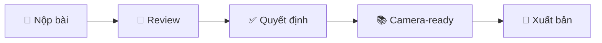

<p align="center">
  <h1 align="center">🎓 UTH-ConfMS</h1>
  <p align="center">
    <strong>Hệ thống Quản lý Hội nghị Khoa học</strong>
    <br/>
    Conference Management System
  </p>
</p>

<p align="center">
  
  
  
  
  
  
</p>

---

## 📋 Mục Lục

- [Giới Thiệu](#-giới-thiệu)
- [Tính Năng](#-tính-năng)
- [Tech Stack](#-tech-stack)
- [Kiến Trúc](#-kiến-trúc)
- [Cài Đặt](#-cài-đặt)
- [Demo & Screenshots](#-demo--screenshots)
- [API Documentation](#-api-documentation)
- [Tài Liệu](#-tài-liệu)
- [Đóng Góp](#-đóng-góp)
- [Nhóm Phát Triển](#-nhóm-phát-triển)

---

## 🎯 Giới Thiệu

**UTH-ConfMS** là hệ thống quản lý hội nghị khoa học toàn diện, được phát triển theo mô hình EasyChair. Hệ thống hỗ trợ toàn bộ quy trình từ **nộp bài** → **đánh giá** → **ra quyết định** → **xuất bản**.

### Vấn Đề Giải Quyết

| Vấn đề                                | Giải pháp UTH-ConfMS                                   |
| ------------------------------------- | ------------------------------------------------------ |
| Quản lý bài nộp thủ công, dễ nhầm lẫn | Hệ thống tự động theo dõi trạng thái, thông báo email  |
| Phân công reviewer khó khăn           | AI gợi ý reviewer phù hợp, kiểm tra COI tự động        |
| Theo dõi tiến độ review kém           | Dashboard real-time cho Chair                          |
| Thiếu bảo mật trong blind review      | Double-blind mode, ẩn thông tin tác giả                |
| Không có AI hỗ trợ                    | Tích hợp Gemini AI: spell check, synopsis, email draft |

---

## ✨ Tính Năng

### 👤 Theo Vai Trò

<table>
<tr>
<td width="50%">

**📝 Author (Tác giả)**

- Nộp bài với PDF (max 50MB)
- Thêm đồng tác giả (co-authors)
- Theo dõi trạng thái bài nộp
- Xem kết quả đánh giá
- Nộp Camera-ready sau accept
- AI spell check cho abstract

</td>
<td width="50%">

**⭐ Reviewer (Người đánh giá)**

- Xem bài được phân công
- Khai báo xung đột lợi ích (COI)
- Nộp đánh giá với điểm & nhận xét
- Thảo luận PC (Program Committee)
- AI synopsis để tóm tắt bài

</td>
</tr>
<tr>
<td>

**🎯 Chair (Chủ tịch)**

- Tạo & quản lý hội nghị
- Thiết lập deadlines
- Tạo tracks/chủ đề
- Phân công reviewer
- Ra quyết định Accept/Reject
- Gửi email thông báo hàng loạt
- Xuất báo cáo thống kê

</td>
<td>

**🔧 Admin (Quản trị viên)**

- Quản lý người dùng
- Phân quyền RBAC
- Cấu hình AI features per conference
- Xem audit logs
- Backup/Restore database

</td>
</tr>
</table>

### 🤖 Tính Năng AI (Gemini Integration)

| Tính năng       | Mô tả                                     |
| --------------- | ----------------------------------------- |
| **Spell Check** | Kiểm tra chính tả & ngữ pháp cho abstract |
| **Synopsis**    | Tạo tóm tắt trung lập cho PC bidding      |
| **Similarity**  | Gợi ý reviewer dựa trên keyword matching  |
| **Email Draft** | Tạo template email Accept/Reject          |
| **Governance**  | Bật/tắt AI per conference, audit logging  |

---

## 🛠 Tech Stack

### Backend

| Công nghệ       | Phiên bản | Mô tả                          |
| --------------- | --------- | ------------------------------ |
| Java            | 21        | Runtime                        |
| Spring Boot     | 3.5.9     | Web framework                  |
| Spring Security | 6.x       | Authentication & Authorization |
| Spring Data JPA | 3.x       | ORM với Hibernate              |
| PostgreSQL      | 16        | Database chính                 |
| Redis           | 7.x       | Caching (optional)             |
| Firebase Auth   | -         | Google SSO                     |
| JWT             | HS256     | Token authentication           |

### Frontend

| Công nghệ    | Phiên bản | Mô tả               |
| ------------ | --------- | ------------------- |
| React        | 19.x      | UI Library          |
| Vite         | 7.x       | Build tool          |
| React Router | 7.x       | Routing             |
| Axios        | 1.x       | HTTP client         |
| i18next      | 25.x      | Đa ngôn ngữ (VI/EN) |
| Firebase     | 12.x      | Google SSO          |

### AI Service

| Công nghệ             | Phiên bản | Mô tả              |
| --------------------- | --------- | ------------------ |
| Python                | 3.11+     | Runtime            |
| FastAPI               | latest    | API framework      |
| Google Gemini         | 1.5+      | AI model           |
| sentence-transformers | latest    | NLP embeddings     |
| asyncpg + psycopg2    | latest    | PostgreSQL drivers |

### DevOps

| Công nghệ      | Mô tả                         |
| -------------- | ----------------------------- |
| Docker         | Containerization              |
| Docker Compose | Multi-container orchestration |
| Nginx          | Reverse proxy                 |
| GitHub Actions | CI/CD (optional)              |

---

## 🏗 Kiến Trúc

```
┌─────────────────────────────────────────────────────────────────┐
│                         CLIENT                                  │
│  ┌──────────────────────────────────────────────────────────┐   │
│  │              Frontend (React + Vite) :5173               │   │
│  │  ┌────────┐ ┌────────┐ ┌────────┐ ┌────────┐ ┌────────┐  │   │
│  │  │ Admin  │ │ Author │ │ Chair  │ │Reviewer│ │ Public │  │   │
│  │  │14 pages│ │12 pages│ │10 pages│ │ 5 pages│ │ 6 pages│  │   │
│  │  └────────┘ └────────┘ └────────┘ └────────┘ └────────┘  │   │
│  └──────────────────────────────────────────────────────────┘   │
└────────────────────────────┬────────────────────────────────────┘
                             │ REST API (HTTPS)
┌────────────────────────────▼────────────────────────────────────┐
│                         SERVER                                  │
│  ┌────────────────────────────────────────────────────────────┐ │
│  │            Backend (Spring Boot) :8080                     │ │
│  │  ┌──────────┐ ┌──────────┐ ┌──────────┐ ┌──────────┐       │ │
│  │  │   Auth   │ │Submission│ │  Review  │ │ Decision │       │ │
│  │  └──────────┘ └──────────┘ └──────────┘ └──────────┘       │ │
│  └────────────────────────────────────────────────────────────┘ │
│  ┌────────────────────────────────────────────────────────────┐ │
│  │            AI Service (FastAPI) :8000                      │ │
│  │  ┌──────────┐ ┌──────────┐ ┌──────────┐ ┌──────────┐       │ │
│  │  │SpellCheck│ │ Synopsis │ │Similarity│ │  Draft   │       │ │
│  │  └──────────┘ └──────────┘ └──────────┘ └──────────┘       │ │
│  └────────────────────────────────────────────────────────────┘ │
└────────────────────────────┬────────────────────────────────────┘
                             │
┌────────────────────────────▼────────────────────────────────────┐
│                          DATA                                   │
│  ┌─────────────────────┐          ┌─────────────────────┐       │
│  │   PostgreSQL :5432  │          │    Redis :6379      │       │
│  │   (24 tables)       │          │    (Cache)          │       │
│  └─────────────────────┘          └─────────────────────┘       │
└─────────────────────────────────────────────────────────────────┘
```

### Cấu Trúc Thư Mục

```
UTH-ConfMS/
├── backend/                 # Spring Boot API
│   ├── src/main/java/edu/uth/backend/
│   │   ├── auth/           # Authentication & JWT
│   │   ├── submission/     # Paper submissions
│   │   ├── review/         # Review system
│   │   ├── decision/       # Accept/Reject
│   │   ├── ai/             # AI integration
│   │   ├── admin/          # Admin management
│   │   ├── entity/         # JPA Entities (24)
│   │   ├── repository/     # Data access (18)
│   │   └── config/         # Security, CORS, etc.
│   └── pom.xml
│
├── frontend/               # React SPA
│   ├── src/
│   │   ├── pages/          # 47 pages total
│   │   │   ├── admin/      # 14 admin pages
│   │   │   ├── author/     # 12 author pages
│   │   │   ├── chair/      # 10 chair pages
│   │   │   ├── reviewer/   # 5 reviewer pages
│   │   │   └── public/     # 6 public pages
│   │   ├── components/     # Shared components
│   │   ├── api/            # API client functions
│   │   ├── i18n/           # Localization (VI/EN)
│   │   └── utils/          # Utilities
│   └── package.json
│
├── ai-service/             # Python AI Microservice
│   ├── src/
│   │   ├── core/nlp/       # NLP processing
│   │   ├── core/services/  # Business logic
│   │   ├── core/governance/# AI governance
│   │   └── api/v1/         # REST endpoints
│   └── requirements.txt
│
├── docker/                 # Docker configuration
│   └── docker-compose.yml
│
├── docs/                   # Documentation (11 files)
│   ├── uml-diagrams.md     # 29 UML diagrams
│   ├── architecture.md
│   ├── detail-design.md
│   ├── srs.md
│   ├── user-requirements.md
│   ├── test-plan.md
│   ├── installation-guide.md
│   ├── user-guide.md
│   ├── system-implementation.md
│   ├── security-configuration.md
│   └── api_checklist.csv
│
└── scripts/                # Utility scripts
    ├── backup-database.sh
    └── restore-database.sh
```

---

## 🚀 Cài Đặt

### Yêu Cầu

| Phần mềm          | Phiên bản |
| ----------------- | --------- |
| Java JDK          | 21+       |
| Node.js           | 20+       |
| Python            | 3.11+     |
| PostgreSQL        | 16+       |
| Docker (optional) | 24+       |

### Cách 1: Docker (Khuyến nghị)

```bash
# Clone repo
git clone https://github.com/TienDat11102k5/UTH-ConfMS.git
cd UTH-ConfMS

# Cấu hình
cd docker
cp .env.example .env
# Chỉnh sửa .env với credentials của bạn

# Khởi chạy
docker-compose up -d

# Truy cập
# Frontend: http://localhost:3000
# Backend:  http://localhost:8080
# AI:       http://localhost:8001
```

### Cách 2: Manual

```bash
# Backend
cd backend
cp .env.example .env
./mvnw spring-boot:run

# Frontend (terminal mới)
cd frontend
npm install
npm run dev

# AI Service (terminal mới)
cd ai-service
python -m venv venv
source venv/bin/activate  # hoặc venv\Scripts\activate (Windows)
pip install -r requirements.txt
uvicorn src.app.main:app --reload --port 8000
```

Chi tiết: [📖 Hướng dẫn cài đặt](docs/installation-guide.md)

---

## 📸 Demo & Screenshots

### Workflow Tổng Quan



### Screenshots

| Màn hình           | Mô tả                                   |
| ------------------ | --------------------------------------- |
| Dashboard Author   | Xem danh sách bài nộp, trạng thái       |
| Form nộp bài       | Upload PDF, thêm co-authors             |
| Dashboard Reviewer | Bài được phân công, form đánh giá       |
| Dashboard Chair    | Quản lý hội nghị, phân công, quyết định |
| Admin Users        | Quản lý users, phân quyền RBAC          |

---

## 📚 API Documentation

### Authentication

| Method | Endpoint                    | Mô tả            |
| ------ | --------------------------- | ---------------- |
| POST   | `/api/auth/register`        | Đăng ký          |
| POST   | `/api/auth/login`           | Đăng nhập        |
| POST   | `/api/auth/google`          | Google SSO       |
| POST   | `/api/auth/forgot-password` | Gửi OTP          |
| POST   | `/api/auth/reset-password`  | Đặt lại mật khẩu |

### Paper Submission

| Method | Endpoint                             | Mô tả            |
| ------ | ------------------------------------ | ---------------- |
| POST   | `/api/submissions`                   | Nộp bài mới      |
| GET    | `/api/submissions/my`                | Bài của tôi      |
| PUT    | `/api/submissions/{id}`              | Cập nhật bài     |
| POST   | `/api/submissions/{id}/camera-ready` | Nộp camera-ready |

### Review

| Method | Endpoint              | Mô tả              |
| ------ | --------------------- | ------------------ |
| GET    | `/api/assignments/my` | Bài được phân công |
| POST   | `/api/reviews`        | Nộp đánh giá       |
| POST   | `/api/coi`            | Khai báo COI       |

Chi tiết: [📖 Detail Design](docs/detail-design.md)

---

## 📖 Tài Liệu

| Tài liệu                                      | Mô tả                   |
| --------------------------------------------- | ----------------------- |
| [📐 UML Diagrams](docs/uml-diagrams.md)       | 29 sơ đồ UML            |
| [🏗 Architecture](docs/architecture.md)       | Kiến trúc hệ thống      |
| [📋 SRS](docs/srs.md)                         | Đặc tả yêu cầu phần mềm |
| [📝 Detail Design](docs/detail-design.md)     | Thiết kế chi tiết       |
| [🧪 Test Plan](docs/test-plan.md)             | Kế hoạch kiểm thử       |
| [🔧 Installation](docs/installation-guide.md) | Hướng dẫn cài đặt       |
| [📖 User Guide](docs/user-guide.md)           | Hướng dẫn sử dụng       |
| [🔐 Security](docs/security-configuration.md) | Cấu hình bảo mật        |

---

## 🤝 Đóng Góp

1. Fork repository
2. Tạo branch: `git checkout -b feature/your-feature`
3. Commit: `git commit -m "feat: Add your feature"`
4. Push: `git push origin feature/your-feature`
5. Tạo Pull Request

---

## 👥 Nhóm Phát Triển

**Đồ án:** Lập Trình Java Nâng Cao  
**Trường:** Đại học Giao thông Vận tải TP.HCM (UTH)  
**Năm:** 2024-2025

| Thành viên |\r\n| ------------------------ |\r\n| **Đỗ Tiến Đạt** |\r\n| **Lưu Nhất Huy** |\r\n| **Phạm Đình Khánh Duy** |\r\n| **Phạm Võ Thành Đạt** |\r\n| **Trần Huỳnh Đức Ninh** |

---

## 📊 Thống Kê Dự Án

| Metric        | Giá trị                  |
| ------------- | ------------------------ |
| Dòng code     | ~50,000+                 |
| API Endpoints | 41                       |
| Pages         | 47                       |
| Entities      | 24                       |
| UML Diagrams  | 29                       |
| Test Cases    | 50+                      |
| Languages     | Java, JavaScript, Python |

---

## 📞 Liên Hệ

- 📧 Email: support@uth.edu.vn
- 🐛 Issues: [GitHub Issues](https://github.com/TienDat11102k5/UTH-ConfMS/issues)
- 📖 Docs: [docs/](docs/)

---

<p align="center">
  <strong>Made with ❤️ by UTH Students</strong>
  <br/>
  <sub>© 2024-2025 UTH-ConfMS. All rights reserved.</sub>
</p>
