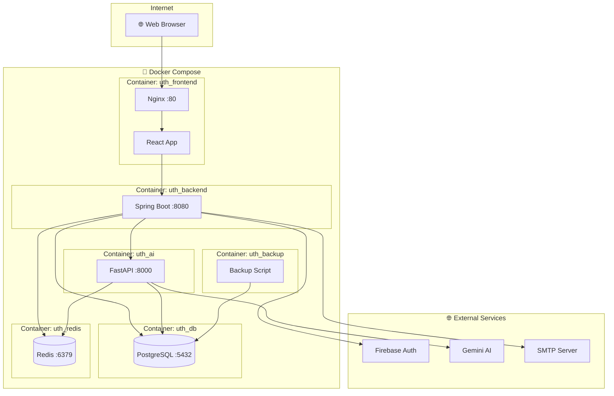
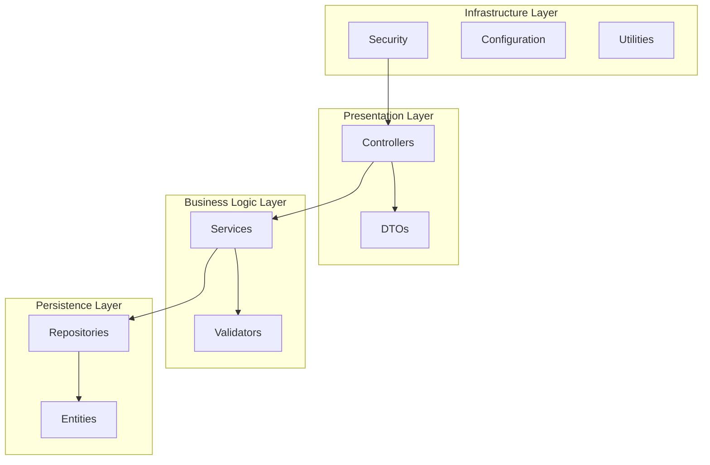
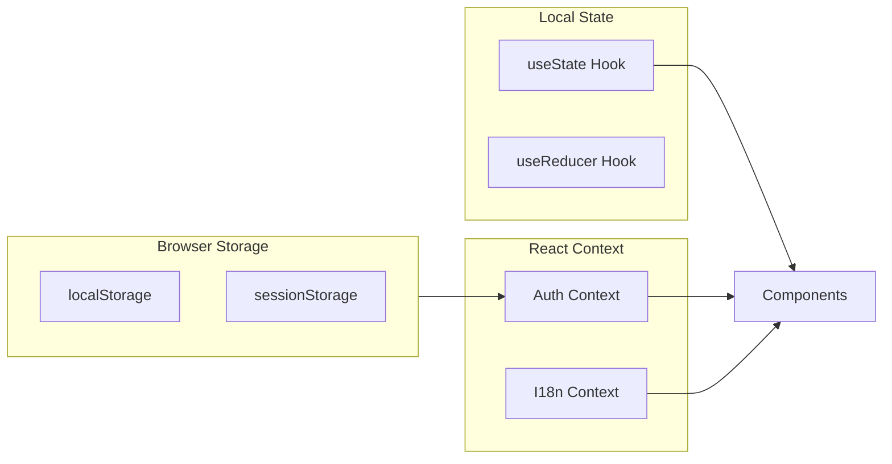
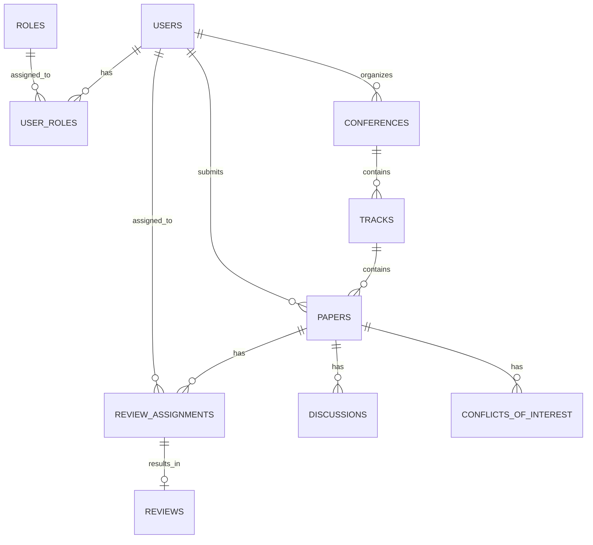
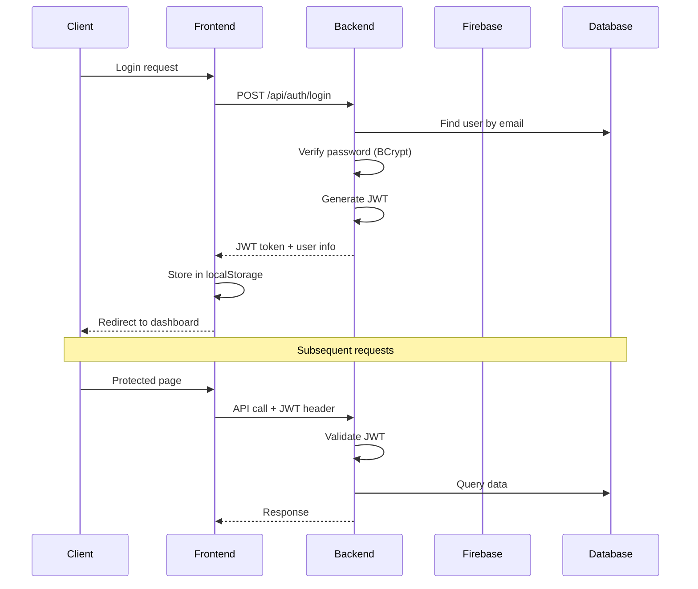
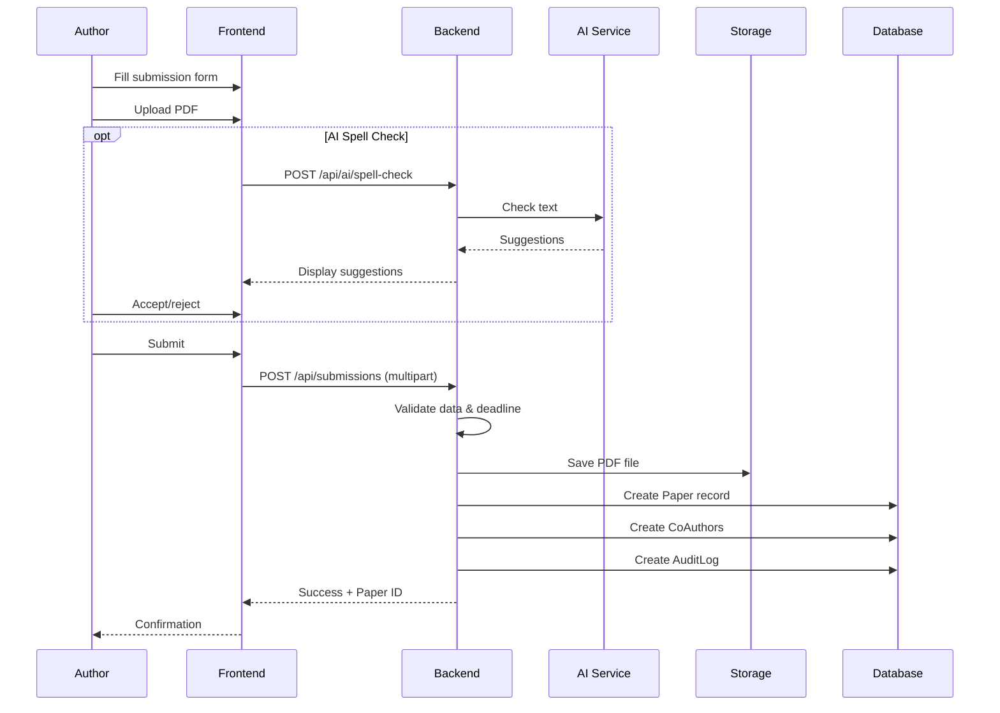
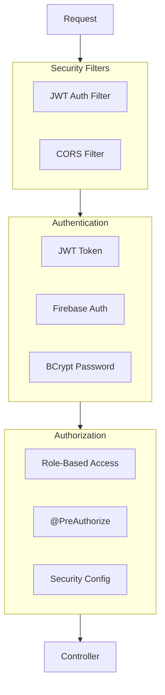

# Kiến Trúc Hệ Thống (Architecture Design)

## Thông Tin Tài Liệu

| Thông tin     | Chi tiết      |
| ------------- | ------------- |
| **Dự án**     | UTH-ConfMS    |
| **Phiên bản** | 1.0           |
| **Ngày tạo**  | Tháng 01/2026 |

---

## 1. Tổng Quan Kiến Trúc

### 1.1 Kiến Trúc Tổng Thể

UTH-ConfMS sử dụng kiến trúc **3-Tier Microservices** với các thành phần chính:

```
┌──────────────────────────────────────────────────────────────────────────┐
│                           CLIENT LAYER                                   │
│  ┌────────────────────────────────────────────────────────────────────┐  │
│  │                    Frontend (React + Vite)                         │  │
│  │  ┌──────────┐ ┌──────────┐ ┌──────────┐ ┌──────────┐ ┌──────────┐  │  │
│  │  │  Admin   │ │  Author  │ │  Chair   │ │ Reviewer │ │  Public  │  │  │
│  │  │  Pages   │ │  Pages   │ │  Pages   │ │  Pages   │ │  Pages   │  │  │
│  │  └──────────┘ └──────────┘ └──────────┘ └──────────┘ └──────────┘  │  │
│  └────────────────────────────────────────────────────────────────────┘  │
└─────────────────────────────────┬────────────────────────────────────────┘
                                  │ HTTPS (REST API)
┌─────────────────────────────────▼────────────────────────────────────────┐
│                           SERVER LAYER                                   │
│  ┌─────────────────────────────────────────────────────────────────────┐ │
│  │                  Backend (Spring Boot 3.x)                          │ │
│  │  ┌───────────┐ ┌───────────┐ ┌───────────┐ ┌───────────┐            │ │
│  │  │Controllers│ │ Services  │ │Repositories│ │ Security  │            │ │
│  │  └───────────┘ └───────────┘ └───────────┘ └───────────┘            │ │
│  └──────────────────────────────┬──────────────────────────────────────┘ │
│                                 │                                        │
│  ┌──────────────────────────────▼──────────────────────────────────────┐ │
│  │                  AI Service (Python FastAPI)                        │ │
│  │  ┌───────────┐ ┌───────────┐ ┌───────────┐ ┌───────────┐            │ │
│  │  │ NLP Core  │ │ Services  │ │ Governance│ │    API    │            │ │
│  │  └───────────┘ └───────────┘ └───────────┘ └───────────┘            │ │
│  └─────────────────────────────────────────────────────────────────────┘ │
└─────────────────────────────────┬────────────────────────────────────────┘
                                  │ JDBC / Redis Protocol
┌─────────────────────────────────▼────────────────────────────────────────┐
│                           DATA LAYER                                     │
│  ┌─────────────────────┐              ┌─────────────────────┐            │
│  │   PostgreSQL 16     │              │       Redis         │            │
│  │   (Primary DB)      │              │     (Cache)         │            │
│  └─────────────────────┘              └─────────────────────┘            │
│                                                                          │
│  ┌─────────────────────────────────────────────────────────────────────┐ │
│  │                    File Storage (uploads/)                          │ │
│  └─────────────────────────────────────────────────────────────────────┘ │
└──────────────────────────────────────────────────────────────────────────┘
```

### 1.2 Mô Hình Triển Khai (Deployment)



---

## 2. Kiến Trúc Chi Tiết Các Thành Phần

### 2.1 Backend Service (Spring Boot)

#### 2.1.1 Cấu Trúc Package

```
edu.uth.backend/
├── BackendApplication.java      # Main class
├── config/                      # Configuration classes
│   ├── SecurityConfig.java      # Spring Security config
│   ├── CorsConfig.java          # CORS configuration
│   ├── RedisConfig.java         # Redis configuration
│   └── FirebaseConfig.java      # Firebase Admin SDK
│
├── entity/                      # JPA Entities
│   ├── User.java
│   ├── Role.java
│   ├── Conference.java
│   ├── Track.java
│   ├── Paper.java
│   ├── Review.java
│   └── ...
│
├── repository/                  # Spring Data JPA Repositories
│   ├── UserRepository.java
│   ├── PaperRepository.java
│   └── ...
│
├── auth/                        # Authentication module
│   ├── AuthController.java
│   ├── AuthService.java
│   └── dto/
│
├── submission/                  # Submission module
│   ├── SubmissionController.java
│   ├── SubmissionService.java
│   └── dto/
│
├── review/                      # Review module
├── decision/                    # Decision module
├── ai/                          # AI integration
├── admin/                       # Admin module
└── security/                    # Security filters & utils
```

#### 2.1.2 Layered Architecture



### 2.2 Frontend Application (React)

#### 2.2.1 Cấu Trúc Thư Mục

```
frontend/src/
├── main.jsx                 # Entry point
├── App.jsx                  # Main component + routing
├── apiClient.js             # Axios configuration
├── auth.js                  # Auth utilities
├── firebase.js              # Firebase config
│
├── api/                     # API call functions
│   ├── submissionAPI.js
│   ├── conferenceAPI.js
│   └── ai/
│
├── components/              # Reusable components
│   ├── Layout/
│   ├── Toast.jsx
│   ├── Pagination.jsx
│   └── ...
│
├── pages/                   # Page components by role
│   ├── admin/               # Admin pages (14)
│   ├── author/              # Author pages (12)
│   ├── chair/               # Chair pages (10)
│   ├── reviewer/            # Reviewer pages (5)
│   └── public/              # Public pages (6)
│
├── styles/                  # CSS styles
├── i18n/                    # Internationalization
│   ├── index.js
│   └── locales/
│       ├── en.json
│       └── vi.json
│
└── utils/                   # Utility functions
```

#### 2.2.2 State Management



### 2.3 AI Service (Python FastAPI)

#### 2.3.1 Cấu Trúc Thư Mục

```
ai-service/src/
├── app/
│   ├── main.py              # FastAPI app entry
│   └── settings.py          # Configuration
│
├── api/
│   └── v1/
│       ├── spell_check.py   # Spell check endpoint
│       ├── synopsis.py      # Synopsis generation
│       ├── similarity.py    # Reviewer-paper matching
│       ├── email_draft.py   # Email template generation
│       └── governance.py    # Feature flags API
│
├── core/
│   ├── nlp/                 # NLP processing
│   │   ├── spell_checker.py
│   │   ├── summarizer.py
│   │   └── keyword_extractor.py
│   │
│   ├── services/            # Business logic
│   │   ├── spell_service.py
│   │   ├── synopsis_service.py
│   │   └── similarity_service.py
│   │
│   ├── governance/          # AI governance
│   │   ├── feature_flags.py
│   │   ├── audit_logger.py
│   │   └── rate_limiter.py
│   │
│   ├── models/              # Data models
│   └── infra/               # Infrastructure
│
└── tests/                   # Test files
```

---

## 3. Thiết Kế Database

### 3.1 ERD Tổng Quan



### 3.2 Các Bảng Chính

| Bảng               | Mô tả                                    | Record ước tính |
| ------------------ | ---------------------------------------- | --------------- |
| users              | Người dùng                               | 1,000+          |
| roles              | Vai trò (ADMIN, CHAIR, REVIEWER, AUTHOR) | 4               |
| conferences        | Hội nghị                                 | 50+             |
| tracks             | Tracks của hội nghị                      | 200+            |
| papers             | Bài báo                                  | 5,000+          |
| review_assignments | Phân công reviewer                       | 15,000+         |
| reviews            | Đánh giá                                 | 10,000+         |
| discussions        | Thảo luận PC                             | 5,000+          |

---

## 4. Luồng Dữ Liệu

### 4.1 Luồng Xác Thực



### 4.2 Luồng Nộp Bài



---

## 5. Bảo Mật

### 5.1 Authentication & Authorization



### 5.2 Security Measures

| Measure          | Implementation                      |
| ---------------- | ----------------------------------- |
| Password Hashing | BCrypt (strength 12)                |
| Token            | JWT với HS256 signature             |
| HTTPS            | TLS 1.3                             |
| CORS             | Whitelist origins                   |
| SQL Injection    | JPA/Hibernate parameterized queries |
| XSS              | React auto-escaping                 |
| CSRF             | Stateless JWT (không cần)           |
| Rate Limiting    | Redis-based (AI endpoints)          |

---

## 6. Công Nghệ Sử Dụng

### 6.1 Backend Stack

| Thành phần | Công nghệ                   | Phiên bản |
| ---------- | --------------------------- | --------- |
| Runtime    | Java                        | 21        |
| Framework  | Spring Boot                 | 3.5.9     |
| Security   | Spring Security             | 6.x       |
| ORM        | Spring Data JPA + Hibernate | 6.x       |
| Database   | PostgreSQL                  | 16        |
| Cache      | Redis                       | 7.x       |
| Build Tool | Maven                       | 3.9+      |

### 6.2 Frontend Stack

| Thành phần  | Công nghệ     | Phiên bản |
| ----------- | ------------- | --------- |
| Library     | React         | 19.x      |
| Build Tool  | Vite          | 7.x       |
| HTTP Client | Axios         | 1.x       |
| Routing     | React Router  | 7.x       |
| i18n        | i18next       | 25.x      |
| Auth        | Firebase Auth | 12.x      |

### 6.3 AI Service Stack

| Thành phần  | Công nghệ             | Phiên bản |
| ----------- | --------------------- | --------- |
| Runtime     | Python                | 3.11+     |
| Framework   | FastAPI               | latest    |
| AI Provider | Google Gemini         | 1.5+      |
| Embeddings  | sentence-transformers | latest    |
| DB Driver   | asyncpg + psycopg2    | latest    |

### 6.4 DevOps Stack

| Thành phần       | Công nghệ      |
| ---------------- | -------------- |
| Containerization | Docker         |
| Orchestration    | Docker Compose |
| CI/CD            | GitHub Actions |
| Reverse Proxy    | Nginx          |

---

## Tài Liệu Liên Quan

- [Chi tiết thiết kế](detail-design.md)
- [Sơ đồ UML](uml-diagrams.md)
- [API Specification](api-spec.md)
- [Hướng dẫn cài đặt](installation-guide.md)
