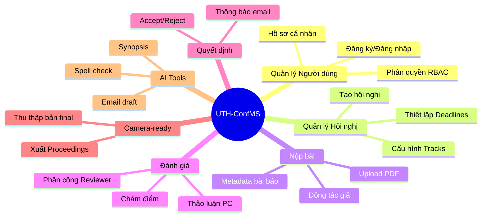

# Đặc Tả Yêu Cầu Phần Mềm (Software Requirements Specification - SRS)

## Thông Tin Tài Liệu

| Thông tin     | Chi tiết      |
| ------------- | ------------- |
| **Dự án**     | UTH-ConfMS    |
| **Phiên bản** | 1.0           |
| **Chuẩn**     | IEEE 830-1998 |
| **Ngày tạo**  | Tháng 01/2026 |

---

## 1. Giới Thiệu

### 1.1 Mục Đích

Tài liệu SRS này định nghĩa các yêu cầu phần mềm chi tiết cho Hệ thống Quản lý Hội nghị Khoa học UTH (UTH-ConfMS). Tài liệu dành cho đội ngũ phát triển, kiểm thử và các bên liên quan.

### 1.2 Phạm Vi

**UTH-ConfMS** là một hệ thống web quản lý hội nghị khoa học theo mô hình EasyChair, cung cấp:

- Quản lý Call for Papers và Submission
- Phân công và đánh giá bài báo
- Ra quyết định và thông báo
- Thu thập Camera-ready và xuất Proceedings
- Tích hợp AI hỗ trợ (opt-in)

### 1.3 Định Nghĩa và Thuật Ngữ

| Thuật ngữ        | Định nghĩa                                                  |
| ---------------- | ----------------------------------------------------------- |
| **CFP**          | Call for Papers - Thông báo mời nộp bài                     |
| **PC**           | Program Committee - Ủy ban chương trình                     |
| **COI**          | Conflict of Interest - Xung đột lợi ích                     |
| **Camera-ready** | Bản final của bài báo sau khi được chấp nhận                |
| **Track**        | Chủ đề/phân ban trong hội nghị                              |
| **Blind Review** | Đánh giá ẩn danh (single/double blind)                      |
| **RBAC**         | Role-Based Access Control - Kiểm soát truy cập theo vai trò |
| **JWT**          | JSON Web Token - Token xác thực                             |
| **SSO**          | Single Sign-On - Đăng nhập một lần                          |

### 1.4 Tham Chiếu

- IEEE Std 830-1998: Recommended Practice for Software Requirements Specifications
- Tài liệu yêu cầu người dùng: [user-requirements.md](user-requirements.md)
- Sơ đồ UML: [uml-diagrams.md](uml-diagrams.md)

---

## 2. Mô Tả Tổng Quan

### 2.1 Góc Nhìn Sản Phẩm

```
┌─────────────────────────────────────────────────────────────┐
│                      UTH-ConfMS                             │
├─────────────────┬─────────────────┬─────────────────────────┤
│   Frontend      │    Backend      │      AI Service         │
│   (React)       │  (Spring Boot)  │    (Python FastAPI)     │
├─────────────────┴─────────────────┴─────────────────────────┤
│                    PostgreSQL + Redis                       │
└─────────────────────────────────────────────────────────────┘
```

Hệ thống UTH-ConfMS là một ứng dụng web độc lập, không phụ thuộc vào hệ thống bên ngoài (ngoại trừ Firebase Auth cho SSO và Gemini AI cho các tính năng AI).

### 2.2 Chức Năng Sản Phẩm



### 2.3 Các Loại Người Dùng

| Vai trò      | Mô tả             | Đặc điểm                       |
| ------------ | ----------------- | ------------------------------ |
| **Author**   | Tác giả nộp bài   | Có tài khoản, kỹ năng cơ bản   |
| **Reviewer** | Người đánh giá    | Chuyên gia, được mời bởi Chair |
| **Chair**    | Chủ tịch hội nghị | Quản lý toàn bộ quy trình      |
| **Admin**    | Quản trị viên     | Quản lý nền tảng, đa hội nghị  |

### 2.4 Môi Trường Hoạt Động

**Client:**

- Trình duyệt web: Chrome 90+, Firefox 88+, Safari 14+, Edge 90+
- Kết nối Internet ổn định
- Màn hình tối thiểu 1280x720

**Server:**

- OS: Linux/Windows Server
- Java 21+
- PostgreSQL 16+
- Redis 7+
- Docker (optional)

### 2.5 Ràng Buộc Thiết Kế

| Ràng buộc          | Mô tả                            |
| ------------------ | -------------------------------- |
| Công nghệ Backend  | Java 21, Spring Boot 3.5.9       |
| Công nghệ Frontend | React 19, Vite 7.x               |
| Database           | PostgreSQL với Redis caching     |
| Authentication     | JWT + Firebase Auth (Google SSO) |
| API Style          | RESTful với OpenAPI/Swagger      |
| Containerization   | Docker + Docker Compose          |

---

## 3. Yêu Cầu Cụ Thể

### 3.1 Yêu Cầu Giao Diện Ngoài

#### 3.1.1 Giao Diện Người Dùng

| Màn hình           | Mô tả                                           | Actors   |
| ------------------ | ----------------------------------------------- | -------- |
| Trang đăng nhập    | Form đăng nhập với email/password và Google SSO | All      |
| Dashboard Author   | Danh sách bài nộp, trạng thái                   | Author   |
| Dashboard Reviewer | Bài được phân công, đánh giá                    | Reviewer |
| Dashboard Chair    | Quản lý hội nghị, submissions, reviews          | Chair    |
| Dashboard Admin    | Quản lý users, tenants, audit logs              | Admin    |
| Form nộp bài       | Upload PDF, metadata, co-authors                | Author   |
| Form đánh giá      | Chấm điểm, nhận xét, confidence                 | Reviewer |

#### 3.1.2 Giao Diện Phần Cứng

Không có yêu cầu giao diện phần cứng đặc biệt.

#### 3.1.3 Giao Diện Phần Mềm

| Hệ thống      | Giao tiếp      | Mục đích            |
| ------------- | -------------- | ------------------- |
| Firebase Auth | REST API       | Google SSO          |
| Gemini AI     | REST API       | NLP features        |
| SMTP Server   | SMTP Protocol  | Gửi email thông báo |
| PostgreSQL    | JDBC           | Lưu trữ dữ liệu     |
| Redis         | Redis Protocol | Caching, session    |

#### 3.1.4 Giao Diện Truyền Thông

- **Protocol:** HTTPS (TLS 1.3)
- **API Format:** JSON
- **Encoding:** UTF-8

### 3.2 Yêu Cầu Chức Năng Chi Tiết

#### 3.2.1 Module Xác Thực (Authentication)

**FR-AUTH-001: Đăng ký tài khoản**

- **Input:** email, password, fullName
- **Xử lý:**
  1. Validate email format và uniqueness
  2. Hash password với BCrypt (strength 12)
  3. Tạo user với role AUTHOR mặc định
  4. Gửi email xác nhận (optional)
- **Output:** User object (không có password)

**FR-AUTH-002: Đăng nhập**

- **Input:** email, password
- **Xử lý:**
  1. Tìm user theo email
  2. Verify password với BCrypt
  3. Generate JWT token (expiry 24h)
  4. Ghi activity log
- **Output:** JWT token, user info, roles

**FR-AUTH-003: Đăng nhập Google SSO**

- **Input:** Firebase ID token
- **Xử lý:**
  1. Verify token với Firebase Admin SDK
  2. Tìm hoặc tạo user (provider = GOOGLE)
  3. Generate JWT token
- **Output:** JWT token, user info

**FR-AUTH-004: Quên mật khẩu**

- **Input:** email
- **Xử lý:**
  1. Generate OTP 6 chữ số
  2. Lưu OTP (TTL 5 phút)
  3. Gửi email chứa OTP
- **Output:** Success message

#### 3.2.2 Module Quản Lý Hội Nghị (Conference)

**FR-CONF-001: Tạo hội nghị**

- **Input:** name, description, dates, deadlines
- **Pre-condition:** User có role CHAIR hoặc ADMIN
- **Xử lý:**
  1. Validate dates (startDate < endDate)
  2. Validate deadlines (submission < review < camera-ready)
  3. Tạo conference với organizer = current user
- **Output:** Conference object

**FR-CONF-002: Tạo Track**

- **Input:** conference_id, name, description
- **Pre-condition:** User là organizer của conference
- **Output:** Track object

#### 3.2.3 Module Nộp Bài (Submission)

**FR-SUB-001: Nộp bài báo**

- **Input:** title, abstract, keywords, track_id, PDF file, co-authors[]
- **Pre-condition:**
  - User đã đăng nhập
  - Còn trong deadline nộp bài
  - Conference chưa bị khóa
- **Xử lý:**
  1. Validate file PDF (size < 50MB, type = application/pdf)
  2. Lưu file vào storage
  3. Tạo Paper với status = SUBMITTED
  4. Tạo các PaperCoAuthor records
  5. Ghi audit log
  6. Gửi email xác nhận
- **Output:** Paper object với ID

**FR-SUB-002: Chỉnh sửa bài**

- **Pre-condition:**
  - User là main author
  - Paper status = SUBMITTED
  - Còn trong deadline
- **Output:** Updated Paper

**FR-SUB-003: Rút bài**

- **Pre-condition:** User là main author
- **Xử lý:** Cập nhật status = WITHDRAWN
- **Output:** Success message

#### 3.2.4 Module Đánh Giá (Review)

**FR-REV-001: Phân công Reviewer**

- **Input:** paper_id, reviewer_id
- **Pre-condition:**
  - User là Chair của conference
  - Không có COI giữa reviewer và paper
- **Xử lý:**
  1. Kiểm tra COI
  2. Tạo ReviewAssignment (status = PENDING)
  3. Gửi email thông báo cho reviewer
- **Output:** ReviewAssignment object

**FR-REV-002: Khai báo COI**

- **Input:** paper_id, reason
- **Pre-condition:** User là reviewer được phân công
- **Output:** ConflictOfInterest record

**FR-REV-003: Nộp đánh giá**

- **Input:** assignment_id, score, confidence, commentForAuthor, commentForPC
- **Pre-condition:**
  - User là reviewer của assignment
  - Assignment status = ACCEPTED hoặc PENDING
  - Còn trong deadline review
- **Xử lý:**
  1. Tạo/cập nhật Review record
  2. Cập nhật Assignment status = COMPLETED
  3. Cập nhật Paper status = UNDER_REVIEW (nếu chưa)
- **Output:** Review object

#### 3.2.5 Module Quyết Định (Decision)

**FR-DEC-001: Ra quyết định**

- **Input:** paper_id, decision (ACCEPTED/REJECTED)
- **Pre-condition:** User là Chair
- **Xử lý:**
  1. Cập nhật Paper status
  2. Ghi audit log
- **Output:** Updated Paper

**FR-DEC-002: Gửi thông báo hàng loạt**

- **Input:** conference_id, template, recipient_type
- **Pre-condition:** User là Chair
- **Xử lý:**
  1. Lấy danh sách recipients
  2. Render template cho từng recipient
  3. Gửi email qua SMTP
- **Output:** Send statistics

### 3.3 Yêu Cầu Hiệu Năng

| Metric               | Yêu cầu                  |
| -------------------- | ------------------------ |
| Response time (API)  | < 500ms cho 95% requests |
| Page load time       | < 3 giây                 |
| Concurrent users     | 500 users đồng thời      |
| File upload          | Hỗ trợ file đến 50MB     |
| Database connections | Connection pool 20-50    |

### 3.4 Ràng Buộc Thiết Kế

| Ràng buộc     | Chi tiết                                |
| ------------- | --------------------------------------- |
| Stateless API | Không lưu session trên server (JWT)     |
| Idempotent    | POST requests nên idempotent khi có thể |
| Pagination    | Mọi list API phải có pagination         |
| Validation    | Validate ở cả client và server          |

### 3.5 Thuộc Tính Hệ Thống

#### 3.5.1 Tính Khả Dụng (Availability)

- Uptime mục tiêu: 99.5%
- Planned maintenance: Tối đa 4 giờ/tháng
- Automatic restart on failure

#### 3.5.2 Tính Bảo Mật (Security)

- Tất cả passwords được hash với BCrypt
- JWT tokens với signature verification
- CORS configuration cho allowed origins
- SQL injection prevention qua JPA
- XSS prevention qua React
- CSRF protection

#### 3.5.3 Tính Bảo Trì (Maintainability)

- Modular architecture
- Logging với multiple levels
- Swagger/OpenAPI documentation
- Code coverage > 70%

#### 3.5.4 Tính Di Động (Portability)

- Containerized với Docker
- Platform independent (JVM)
- No vendor lock-in

---

## 4. Appendix

### 4.1 Ma Trận Truy Xuất (Traceability Matrix)

| Yêu cầu User | Yêu cầu Phần mềm         |
| ------------ | ------------------------ |
| UR-001       | FR-AUTH-001              |
| UR-002       | FR-AUTH-002, FR-AUTH-003 |
| UR-003       | FR-AUTH-004              |
| UR-010       | FR-CONF-001              |
| UR-020       | FR-SUB-001               |
| UR-030       | FR-REV-001               |
| UR-033       | FR-REV-003               |
| UR-041       | FR-DEC-001               |

### 4.2 Tài Liệu Liên Quan

- [User Requirements](user-requirements.md)
- [Architecture Design](architecture.md)
- [UML Diagrams](uml-diagrams.md)
- [API Specification](api-spec.md)
