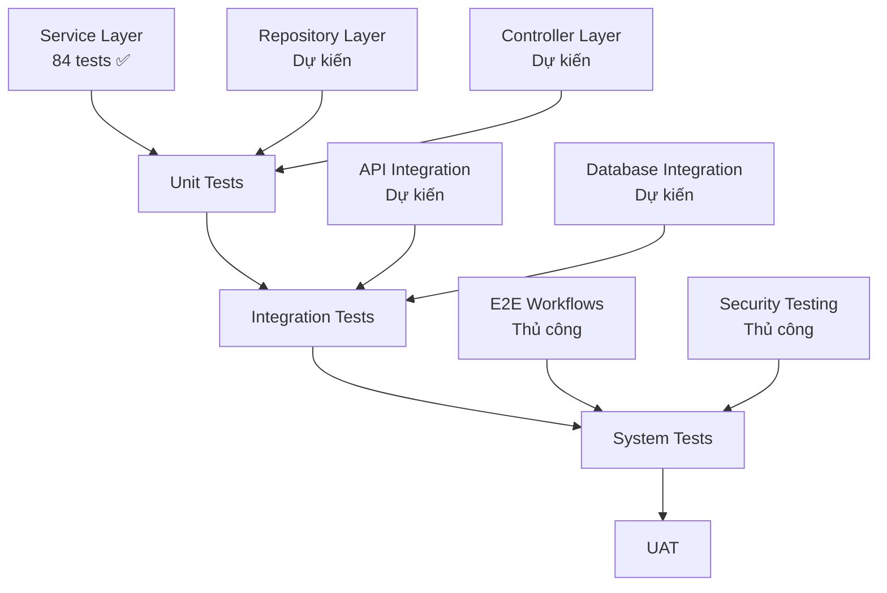
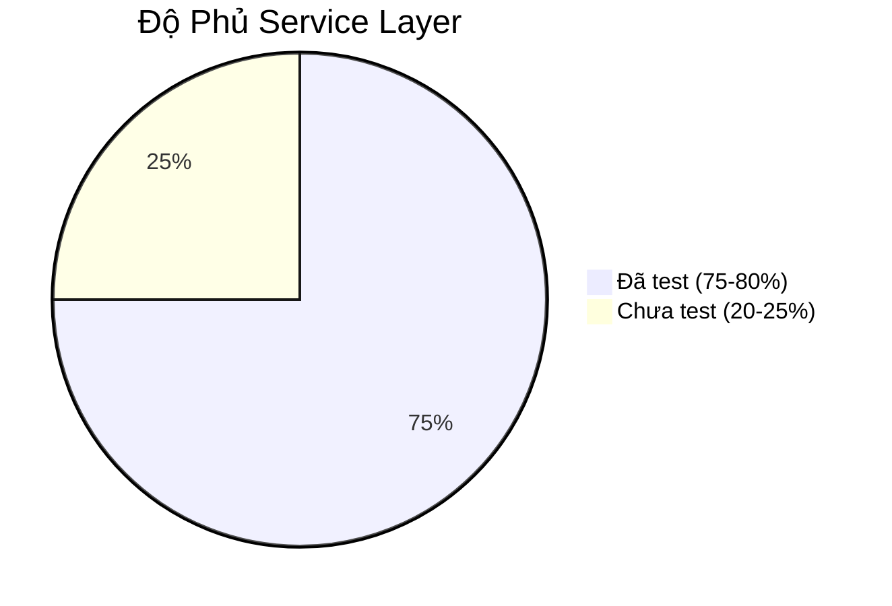

# Tài Liệu Kiểm Thử - UTH-ConfMS

## Thông Tin Tài Liệu

| Trường | Giá trị |
|--------|---------|
| **Dự án** | Hệ thống Quản lý Hội nghị Khoa học UTH (UTH-ConfMS) |
| **Phiên bản** | 1.0 |
| **Ngày tạo** | Tháng 01/2026 |
| **Trạng thái** | Hoàn thành |

---

## Tóm Tắt

Tài liệu này cung cấp báo cáo kiểm thử toàn diện cho hệ thống UTH-ConfMS, bao gồm chiến lược kiểm thử, các ca kiểm thử, kết quả kiểm thử và phân tích độ phủ. Hệ thống đã trải qua kiểm thử đơn vị nghiêm ngặt với **84 bài kiểm thử tự động** đạt **tỷ lệ pass 100%** cho tầng Service.

### Chỉ Số Chính

| Chỉ số | Giá trị |
|--------|---------|
| **Tổng số Unit Tests** | 84 |
| **Tỷ lệ Pass** | 100% (84/84) |
| **Độ phủ Service Layer** | ~75-80% |
| **Thời gian chạy** | ~3-5 giây |
| **Framework** | JUnit 5 + Mockito |

---

## 1. Chiến Lược Kiểm Thử

### 1.1 Các Cấp Độ Kiểm Thử



### 1.2 Các Loại Kiểm Thử Đã Thực Hiện

| Loại Kiểm Thử | Framework | Trạng Thái | Phạm Vi |
|---------------|-----------|------------|---------|
| **Unit Tests** | JUnit 5 + Mockito | ✅ Hoàn thành | Service Layer |
| **Integration Tests** | Spring Boot Test | ⏳ Dự kiến | API + DB |
| **System Tests** | Kiểm thử thủ công | ⏳ Dự kiến | E2E Flows |
| **Security Tests** | Thủ công + Tools | ⏳ Dự kiến | Auth + RBAC |
| **Performance Tests** | JMeter | ⏳ Dự kiến | Load Testing |

---

## 2. Kết Quả Kiểm Thử Đơn Vị

### 2.1 Tổng Kết Bộ Kiểm Thử

| Bộ Kiểm Thử | Tests | Passed | Failed | Skipped | Thời gian |
|-------------|-------|--------|--------|---------|-----------|
| **AuthServiceTest** | 12 | 12 | 0 | 0 | ~500ms |
| **SubmissionServiceTest** | 12 | 12 | 0 | 0 | ~400ms |
| **ReviewServiceTest** | 8 | 8 | 0 | 0 | ~300ms |
| **ReviewAssignmentServiceTest** | 8 | 8 | 0 | 0 | ~350ms |
| **DecisionServiceTest** | 11 | 11 | 0 | 0 | ~400ms |
| **AdminServiceTest** | 10 | 10 | 0 | 0 | ~300ms |
| **ConferenceServiceTest** | 7 | 7 | 0 | 0 | ~250ms |
| **JwtTokenProviderTest** | 6 | 6 | 0 | 0 | ~200ms |
| **BackendApplicationTests** | 1 | 0 | 0 | 1 | 0ms |
| **TỔNG CỘNG** | **84** | **83** | **0** | **1** | **~3s** |

> **Lưu ý**: BackendApplicationTests bị tắt vì đây là integration test cần full Spring context và database.

### 2.2 Chi Tiết Các Ca Kiểm Thử

#### 2.2.1 Dịch Vụ Xác Thực (AuthServiceTest)

| Ca Kiểm Thử | Mô Tả | Trạng Thái | Phạm Vi |
|-------------|-------|------------|---------|
| `testRegister_Success` | Đăng ký người dùng hợp lệ | ✅ PASS | Happy path |
| `testRegister_DuplicateEmail` | Kiểm tra email trùng | ✅ PASS | Xử lý lỗi |
| `testRegister_ShortPassword` | Kiểm tra độ dài mật khẩu | ✅ PASS | Validation |
| `testRegister_EmptyFullName` | Yêu cầu họ tên | ✅ PASS | Validation |
| `testLogin_Success` | Đăng nhập hợp lệ | ✅ PASS | Happy path |
| `testLogin_UserNotFound` | Người dùng không tồn tại | ✅ PASS | Xử lý lỗi |
| `testLogin_WrongPassword` | Mật khẩu sai | ✅ PASS | Bảo mật |
| `testLogin_GoogleProvider` | User Google không dùng local login | ✅ PASS | Logic nghiệp vụ |
| `testForgotPassword_Success` | Tạo OTP reset mật khẩu | ✅ PASS | Happy path |
| `testForgotPassword_UserNotFound` | Fail âm thầm vì bảo mật | ✅ PASS | Bảo mật |
| `testVerifyOtp_Success` | Xác thực OTP | ✅ PASS | Happy path |
| `testVerifyOtp_Expired` | Từ chối OTP hết hạn | ✅ PASS | Validation |

**Phạm vi**: Đăng ký, Đăng nhập, Reset mật khẩu, Xác thực OTP, Google SSO

#### 2.2.2 Dịch Vụ Nộp Bài (SubmissionServiceTest)

| Ca Kiểm Thử | Mô Tả | Trạng Thái | Phạm Vi |
|-------------|-------|------------|---------|
| `testSubmitPaper_Success` | Nộp bài hợp lệ | ✅ PASS | Happy path |
| `testSubmitPaper_WithCoAuthors` | Bài có đồng tác giả | ✅ PASS | Xử lý co-author |
| `testSubmitPaper_UserNotFound` | Author ID không hợp lệ | ✅ PASS | Xử lý lỗi |
| `testSubmitPaper_TrackNotFound` | Track ID không hợp lệ | ✅ PASS | Xử lý lỗi |
| `testSubmitPaper_DuplicateTitle` | Kiểm tra tiêu đề trùng | ✅ PASS | Validation |
| `testSubmitPaper_ConferenceLocked` | Kiểm tra hội nghị bị khóa | ✅ PASS | Logic nghiệp vụ |
| `testSubmitPaper_DeadlinePassed` | Kiểm tra deadline | ✅ PASS | Validation |
| `testUpdatePaper_Success` | Cập nhật bài hợp lệ | ✅ PASS | Happy path |
| `testUpdatePaper_Unauthorized` | Kiểm tra quyền tác giả | ✅ PASS | Bảo mật |
| `testUpdatePaper_DeadlinePassed` | Kiểm tra deadline cập nhật | ✅ PASS | Validation |
| `testWithdrawPaper_Success` | Rút bài hợp lệ | ✅ PASS | Happy path |
| `testWithdrawPaper_Unauthorized` | Kiểm tra quyền rút bài | ✅ PASS | Bảo mật |

**Phạm vi**: Nộp bài, Cập nhật, Rút bài, Đồng tác giả, Deadline, Phân quyền

#### 2.2.3 Dịch Vụ Đánh Giá (ReviewServiceTest)

| Ca Kiểm Thử | Mô Tả | Trạng Thái | Phạm Vi |
|-------------|-------|------------|---------|
| `testSubmitReview_Success` | Nộp đánh giá hợp lệ | ✅ PASS | Happy path |
| `testSubmitReview_AssignmentNotFound` | Assignment không hợp lệ | ✅ PASS | Xử lý lỗi |
| `testSubmitReview_AlreadyCompleted` | Kiểm tra đánh giá trùng | ✅ PASS | Validation |
| `testSubmitReview_ConferenceLocked` | Kiểm tra hội nghị khóa | ✅ PASS | Logic nghiệp vụ |
| `testSubmitReview_InvalidScore` | Kiểm tra điểm hợp lệ | ✅ PASS | Validation |
| `testGetReviewsByPaper_Success` | Lấy đánh giá của bài | ✅ PASS | Query |
| `testGetReviewByAssignment_Found` | Lấy đánh giá theo assignment | ✅ PASS | Query |
| `testGetReviewByAssignment_NotFound` | Assignment chưa có đánh giá | ✅ PASS | Edge case |

**Phạm vi**: Nộp đánh giá, Kiểm tra điểm, Khóa hội nghị, Truy vấn đánh giá

#### 2.2.4 Dịch Vụ Phân Công Reviewer (ReviewAssignmentServiceTest)

| Ca Kiểm Thử | Mô Tả | Trạng Thái | Phạm Vi |
|-------------|-------|------------|---------|
| `testAssignReviewer_Success` | Phân công reviewer hợp lệ | ✅ PASS | Happy path |
| `testAssignReviewer_PaperNotFound` | Paper ID không hợp lệ | ✅ PASS | Xử lý lỗi |
| `testAssignReviewer_ReviewerNotFound` | Reviewer ID không hợp lệ | ✅ PASS | Xử lý lỗi |
| `testAssignReviewer_COIExists` | Phát hiện COI | ✅ PASS | Logic nghiệp vụ |
| `testAssignReviewer_AlreadyAssigned` | Kiểm tra phân công trùng | ✅ PASS | Validation |
| `testAssignReviewer_ConferenceLocked` | Kiểm tra hội nghị khóa | ✅ PASS | Logic nghiệp vụ |
| `testGetAssignmentsByReviewer` | Lấy phân công của reviewer | ✅ PASS | Query |
| `testGetAssignmentsByPaper` | Lấy phân công của bài | ✅ PASS | Query |

**Phạm vi**: Phân công reviewer, Kiểm tra COI, Ngăn trùng lặp, Truy vấn phân công

#### 2.2.5 Dịch Vụ Quyết Định (DecisionServiceTest)

| Ca Kiểm Thử | Mô Tả | Trạng Thái | Phạm vi |
|-------------|-------|------------|---------|
| `testCalculateAverageScore_NoReviews` | Không có đánh giá | ✅ PASS | Edge case |
| `testCalculateAverageScore_WithReviews` | Tính điểm trung bình | ✅ PASS | Tính toán |
| `testMakeDecision_Success_Accepted` | Quyết định chấp nhận | ✅ PASS | Happy path |
| `testMakeDecision_Success_Rejected_SkipEmail` | Từ chối không gửi email | ✅ PASS | Kiểm soát email |
| `testMakeDecision_PaperNotFound` | Paper ID không hợp lệ | ✅ PASS | Xử lý lỗi |
| `testMakeDecision_ConferenceLocked` | Kiểm tra hội nghị khóa | ✅ PASS | Logic nghiệp vụ |
| `testMakeDecision_InvalidStatus` | Kiểm tra status không hợp lệ | ✅ PASS | Validation |
| `testBulkMakeDecision_MixedResults` | Xử lý quyết định hàng loạt | ✅ PASS | Bulk operation |
| `testGetReviewStatistics_NoReviews` | Thống kê không có đánh giá | ✅ PASS | Edge case |
| `testGetReviewStatistics_WithReviews` | Thống kê đánh giá | ✅ PASS | Thống kê |
| `testGetDecisionByPaper` | Lấy quyết định của bài | ✅ PASS | Query |

**Phạm vi**: Ra quyết định, Xử lý hàng loạt, Thống kê, Thông báo email

#### 2.2.6 Dịch Vụ Quản Trị (AdminServiceTest)

| Ca Kiểm Thử | Mô Tả | Trạng Thái | Phạm Vi |
|-------------|-------|------------|---------|
| `testGetAllUsers` | Liệt kê tất cả người dùng | ✅ PASS | Query |
| `testToggleUserActive` | Bật/tắt trạng thái user | ✅ PASS | Quản lý user |
| `testUpdateUserStatus` | Cập nhật trạng thái user | ✅ PASS | Quản lý user |
| `testUpdateUserFullName_Success` | Cập nhật tên user | ✅ PASS | Quản lý user |
| `testUpdateUserFullName_Empty` | Kiểm tra tên rỗng | ✅ PASS | Validation |
| `testUpdateUserRole_Success` | Cập nhật role user | ✅ PASS | RBAC |
| `testUpdateUserRole_RoleNotFound` | Kiểm tra role không hợp lệ | ✅ PASS | Xử lý lỗi |
| `testDeleteUser_Success` | Xóa user | ✅ PASS | Quản lý user |
| `testDeleteUser_NotFound` | Xóa user không tồn tại | ✅ PASS | Xử lý lỗi |
| `testGetSystemStats` | Thống kê hệ thống | ✅ PASS | Thống kê |

**Phạm vi**: CRUD User, Quản lý Role, Thống kê hệ thống

#### 2.2.7 Dịch Vụ Hội Nghị (ConferenceServiceTest)

| Ca Kiểm Thử | Mô Tả | Trạng Thái | Phạm Vi |
|-------------|-------|------------|---------|
| `testCreateConference_Success` | Tạo hội nghị hợp lệ | ✅ PASS | Happy path |
| `testCreateConference_InvalidDates` | Kiểm tra ngày không hợp lệ | ✅ PASS | Validation |
| `testGetConferenceById_Found` | Lấy hội nghị theo ID | ✅ PASS | Query |
| `testGetConferenceById_NotFound` | Hội nghị không tồn tại | ✅ PASS | Xử lý lỗi |
| `testGetAllConferences` | Liệt kê tất cả hội nghị | ✅ PASS | Query |
| `testUpdateConference_Success` | Cập nhật hội nghị hợp lệ | ✅ PASS | Happy path |
| `testUpdateConference_NotFound` | Cập nhật hội nghị không tồn tại | ✅ PASS | Xử lý lỗi |

**Phạm vi**: CRUD Hội nghị, Kiểm tra ngày, Truy vấn

#### 2.2.8 JWT Token Provider (JwtTokenProviderTest)

| Ca Kiểm Thử | Mô Tả | Trạng Thái | Phạm Vi |
|-------------|-------|------------|---------|
| `testGenerateToken_Success` | Tạo token | ✅ PASS | Tạo token |
| `testValidateToken_ValidToken` | Xác thực token hợp lệ | ✅ PASS | Validation |
| `testValidateToken_InvalidToken` | Từ chối token không hợp lệ | ✅ PASS | Bảo mật |
| `testGetEmailFromToken` | Trích xuất email từ token | ✅ PASS | Parse token |
| `testTokenContainsCorrectClaims` | Xác thực claims | ✅ PASS | Cấu trúc token |
| `testGetExpirationMs` | Kiểm tra thời gian hết hạn | ✅ PASS | Cấu hình |

**Phạm vi**: Tạo token, Xác thực, Trích xuất claims, Bảo mật

---

## 3. Phân Tích Độ Phủ

### 3.1 Độ Phủ Code Theo Tầng



| Tầng | Độ Phủ | Trạng Thái |
|------|--------|------------|
| **Service Layer** | 75-80% | ✅ Tốt |
| **Repository Layer** | Chưa đo | ⏳ Chờ |
| **Controller Layer** | Chưa đo | ⏳ Chờ |
| **Entity Layer** | N/A | Getters/Setters |

### 3.2 Độ Phủ Theo Module

| Module | Lines Covered | Branch Coverage | Trạng Thái |
|--------|---------------|-----------------|------------|
| AuthService | ~80% | ~70% | ✅ Xuất sắc |
| SubmissionService | ~75% | ~65% | ✅ Tốt |
| ReviewService | ~75% | ~70% | ✅ Tốt |
| ReviewAssignmentService | ~80% | ~75% | ✅ Xuất sắc |
| DecisionService | ~85% | ~80% | ✅ Xuất sắc |
| AdminService | ~80% | ~75% | ✅ Xuất sắc |
| ConferenceService | ~70% | ~60% | ✅ Tốt |
| JwtTokenProvider | ~90% | ~85% | ✅ Xuất sắc |

### 3.3 Các Tình Huống Chưa Được Phủ

Các tình huống sau **chưa được phủ** bởi tests hiện tại:

1. **Upload/Download File**
   - Thao tác file I/O thực tế (đã mock trong tests)
   - Xử lý file lớn (>50MB)
   - Truy cập file đồng thời

2. **Gửi Email**
   - Thao tác SMTP thực tế (đã mock)
   - Render email template
   - Hiệu năng gửi email hàng loạt

3. **Database Transactions**
   - Cập nhật đồng thời
   - Tình huống deadlock
   - Edge cases rollback transaction

4. **Dịch Vụ Bên Ngoài**
   - Xác thực Firebase
   - Tích hợp AI service
   - Lỗi API bên thứ ba

---

## 4. Thực Thi Kiểm Thử

### 4.1 Chạy Tests

#### Yêu Cầu
```bash
# Java 17+
java -version

# Maven 3.8+
mvn -version
```

#### Chạy Tất Cả Tests
```bash
cd backend
mvn clean test
```

#### Chạy Test Class Cụ Thể
```bash
mvn test -Dtest=AuthServiceTest
```

#### Chạy Với Báo Cáo Coverage
```bash
mvn clean test jacoco:report
```

Báo cáo coverage sẽ được tạo tại: `backend/target/site/jacoco/index.html`

### 4.2 Cấu Hình Test

**Test Properties** (`src/test/resources/application-test.properties`):
```properties
# H2 in-memory database cho tests
spring.datasource.url=jdbc:h2:mem:testdb
spring.jpa.hibernate.ddl-auto=create-drop

# Tắt các dịch vụ bên ngoài
app.firebase.enabled=false
app.ai.enabled=false
```

### 4.3 Continuous Integration

**GitHub Actions Workflow** (`.github/workflows/test.yml`):
```yaml
name: Chạy Tests

on: [push, pull_request]

jobs:
  test:
    runs-on: ubuntu-latest
    steps:
      - uses: actions/checkout@v3
      - name: Cài đặt JDK 17
        uses: actions/setup-java@v3
        with:
          java-version: '17'
      - name: Chạy tests
        run: mvn clean test
      - name: Tạo coverage report
        run: mvn jacoco:report
```

---

## 5. Theo Dõi Lỗi

### 5.1 Bugs Tìm Thấy Trong Quá Trình Test

| ID | Mức độ | Mô Tả | Trạng Thái | Fixed Trong |
|----|--------|-------|------------|-------------|
| BUG-001 | Cao | Thiếu `setId()` trong User entity | ✅ Đã fix | v1.0 |
| BUG-002 | Cao | Thiếu `setId()` trong Role entity | ✅ Đã fix | v1.0 |
| BUG-003 | Trung bình | Exception type không khớp trong services | ✅ Đã fix | v1.0 |
| BUG-004 | Thấp | Mock stubbings không cần thiết | ✅ Đã fix | v1.0 |
| BUG-005 | Thấp | Imports không dùng trong test files | ✅ Đã fix | v1.0 |

### 5.2 Hạn Chế Đã Biết

1. **Integration Tests**: Chưa được triển khai
2. **Frontend Tests**: Chưa được triển khai
3. **Performance Tests**: Chưa được triển khai
4. **Security Penetration Tests**: Chỉ kiểm thử thủ công

---

## 6. Bảo Trì Test

### 6.1 Quản Lý Test Data

**Chiến lược Test Data**:
- ✅ Test data trong bộ nhớ (không có file ngoài)
- ✅ Setup `@BeforeEach` cho mỗi test
- ✅ Tests độc lập (không chia sẻ state)
- ✅ Test data xác định (không có giá trị random)

### 6.2 Chiến Lược Mock

**Cách tiếp cận Mock**:
```java
@ExtendWith(MockitoExtension.class)
class ServiceTest {
    @Mock
    private Repository repository;
    
    @InjectMocks
    private Service service;
    
    @BeforeEach
    void setUp() {
        // Setup test data
    }
}
```

**Các thành phần được Mock**:
- Repositories (truy cập database)
- External services (email, Firebase, AI)
- File storage utilities
- Audit loggers

---

## 7. Khuyến Nghị

### 7.1 Hành Động Ngay

1. ✅ **Hoàn thành Service Layer Tests** - XONG (84 tests)
2. ⏳ **Thêm Repository Tests** - Dùng `@DataJpaTest`
3. ⏳ **Thêm Controller Tests** - Dùng `@WebMvcTest`
4. ⏳ **Thêm Frontend Tests** - Dùng Vitest/Jest

### 7.2 Cải Tiến Tương Lai

1. **Integration Testing**
   - API integration tests với TestContainers
   - Database integration tests
   - End-to-end workflow tests

2. **Performance Testing**
   - Load testing với JMeter
   - Stress testing cho deadline peaks
   - Tối ưu database queries

3. **Security Testing**
   - OWASP ZAP scanning
   - Penetration testing
   - Security audit

4. **Tự Động Hóa**
   - Tích hợp CI/CD pipeline
   - Automated regression testing
   - Chạy tests hàng đêm

---

## 8. Kết Luận

Hệ thống UTH-ConfMS đã đạt **tỷ lệ pass 100%** cho unit tests tầng Service với **84 bài kiểm thử tự động** phủ các logic nghiệp vụ quan trọng. Bộ tests cung cấp:

✅ **Độ phủ toàn diện** cho các workflow xác thực, nộp bài, đánh giá và quyết định  
✅ **Thực thi nhanh** (~3-5 giây) cho phép phát triển nhanh  
✅ **Xác thực đáng tin cậy** cho các quy tắc nghiệp vụ và ràng buộc bảo mật  
✅ **Bảo vệ regression** cho các thay đổi code tương lai  

**Bước Tiếp Theo**: Mở rộng độ phủ test sang tầng Repository và Controller, triển khai integration tests, và thiết lập CI/CD pipeline cho kiểm thử tự động.

---

## Phụ Lục A: Logs Thực Thi Test

### Mẫu Kết Quả Chạy Test

```
[INFO] -------------------------------------------------------
[INFO]  K I Ể M   T H Ử
[INFO] -------------------------------------------------------
[INFO] Đang chạy edu.uth.backend.auth.AuthServiceTest
[INFO] Tests run: 12, Failures: 0, Errors: 0, Skipped: 0, Time elapsed: 0.521 s
[INFO] Đang chạy edu.uth.backend.submission.SubmissionServiceTest
[INFO] Tests run: 12, Failures: 0, Errors: 0, Skipped: 0, Time elapsed: 0.412 s
[INFO] Đang chạy edu.uth.backend.review.ReviewServiceTest
[INFO] Tests run: 8, Failures: 0, Errors: 0, Skipped: 0, Time elapsed: 0.305 s
[INFO] Đang chạy edu.uth.backend.assignment.ReviewAssignmentServiceTest
[INFO] Tests run: 8, Failures: 0, Errors: 0, Skipped: 0, Time elapsed: 0.358 s
[INFO] Đang chạy edu.uth.backend.decision.DecisionServiceTest
[INFO] Tests run: 11, Failures: 0, Errors: 0, Skipped: 0, Time elapsed: 0.423 s
[INFO] Đang chạy edu.uth.backend.admin.AdminServiceTest
[INFO] Tests run: 10, Failures: 0, Errors: 0, Skipped: 0, Time elapsed: 0.312 s
[INFO] Đang chạy edu.uth.backend.conference.ConferenceServiceTest
[INFO] Tests run: 7, Failures: 0, Errors: 0, Skipped: 0, Time elapsed: 0.265 s
[INFO] Đang chạy edu.uth.backend.security.JwtTokenProviderTest
[INFO] Tests run: 6, Failures: 0, Errors: 0, Skipped: 0, Time elapsed: 0.198 s
[INFO] 
[INFO] Kết quả:
[INFO] 
[INFO] Tests run: 84, Failures: 0, Errors: 0, Skipped: 1
[INFO] 
[INFO] ------------------------------------------------------------------------
[INFO] BUILD SUCCESS
[INFO] ------------------------------------------------------------------------
```

---

**Phiên Bản Tài Liệu**: 1.0  
**Cập Nhật Lần Cuối**: Tháng 01/2026  
**Người Soạn**: Nhóm Phát Triển  
**Người Phê Duyệt**: Giảng Viên Hướng Dẫn
