# Tài Liệu UML - Hệ Thống Quản Lý Hội Nghị Khoa Học UTH-ConfMS

## Mục Lục

1. [Sơ Đồ Use Case](#1-sơ-đồ-use-case)
2. [Sơ Đồ Lớp (Class Diagram)](#2-sơ-đồ-lớp-class-diagram)
3. [Sơ Đồ Tuần Tự (Sequence Diagram)](#3-sơ-đồ-tuần-tự-sequence-diagram)
4. [Sơ Đồ Hoạt Động (Activity Diagram)](#4-sơ-đồ-hoạt-động-activity-diagram)
5. [Sơ Đồ Thành Phần (Component Diagram)](#5-sơ-đồ-thành-phần-component-diagram)
6. [Bảng Tổng Hợp](#6-bảng-tổng-hợp)
7. [Sơ Đồ Trạng Thái (State Diagram)](#7-sơ-đồ-trạng-thái-state-diagram)
8. [Sơ Đồ ERD (Entity-Relationship Diagram)](#8-sơ-đồ-erd-entity-relationship-diagram)
9. [Sơ Đồ BPMN (Business Process Model)](#9-sơ-đồ-bpmn-business-process-model)

---

## 1. Sơ Đồ Use Case

### 1.1 Sơ Đồ Use Case Tổng Thể Hệ Thống

```mermaid
flowchart TB
    subgraph Actors["👥 Các Tác Nhân"]
        Author["🧑‍💻 Tác Giả<br/>(Author)"]
        Reviewer["📝 Người Đánh Giá<br/>(Reviewer)"]
        Chair["👔 Chủ Tịch Hội Nghị<br/>(Chair)"]
        Admin["⚙️ Quản Trị Viên<br/>(Admin)"]
    end

    subgraph AuthSystem["🔐 Xác Thực"]
        UC1["Đăng ký tài khoản"]
        UC2["Đăng nhập"]
        UC3["Đăng nhập Google SSO"]
        UC4["Quên mật khẩu"]
        UC5["Quản lý hồ sơ cá nhân"]
    end

    subgraph SubmissionSystem["📄 Quản Lý Bài Nộp"]
        UC10["Nộp bài báo"]
        UC11["Chỉnh sửa bài trước deadline"]
        UC12["Rút bài (Withdraw)"]
        UC13["Xem trạng thái bài nộp"]
        UC14["Xem kết quả đánh giá"]
        UC15["Nộp Camera-ready"]
    end

    subgraph ReviewSystem["⭐ Hệ Thống Đánh Giá"]
        UC20["Xem bài được phân công"]
        UC21["Nộp đánh giá"]
        UC22["Khai báo xung đột lợi ích"]
        UC23["Tham gia thảo luận PC"]
        UC24["Xem AI Synopsis"]
    end

    subgraph ChairSystem["🎯 Quản Lý Hội Nghị"]
        UC30["Tạo hội nghị mới"]
        UC31["Cấu hình Tracks/Deadlines"]
        UC32["Mời PC Members"]
        UC33["Phân công Reviewer"]
        UC34["Theo dõi tiến độ"]
        UC35["Ra quyết định Accept/Reject"]
        UC36["Gửi thông báo hàng loạt"]
        UC37["Mở vòng Camera-ready"]
        UC38["Xuất Proceedings"]
    end

    subgraph AdminSystem["🔧 Quản Trị Hệ Thống"]
        UC40["Quản lý người dùng"]
        UC41["Phân quyền RBAC"]
        UC42["Cấu hình SMTP"]
        UC43["Quản lý Tenant"]
        UC44["Sao lưu/Khôi phục"]
        UC45["Xem Audit Logs"]
        UC46["Quản lý AI Governance"]
    end

    %% Connections
    Author --> UC1
    Author --> UC2
    Author --> UC3
    Author --> UC4
    Author --> UC5
    Author --> UC10
    Author --> UC11
    Author --> UC12
    Author --> UC13
    Author --> UC14
    Author --> UC15

    Reviewer --> UC2
    Reviewer --> UC20
    Reviewer --> UC21
    Reviewer --> UC22
    Reviewer --> UC23
    Reviewer --> UC24

    Chair --> UC2
    Chair --> UC30
    Chair --> UC31
    Chair --> UC32
    Chair --> UC33
    Chair --> UC34
    Chair --> UC35
    Chair --> UC36
    Chair --> UC37
    Chair --> UC38

    Admin --> UC2
    Admin --> UC40
    Admin --> UC41
    Admin --> UC42
    Admin --> UC43
    Admin --> UC44
    Admin --> UC45
    Admin --> UC46
```

### 1.2 Use Case Chi Tiết - Tác Giả (Author)

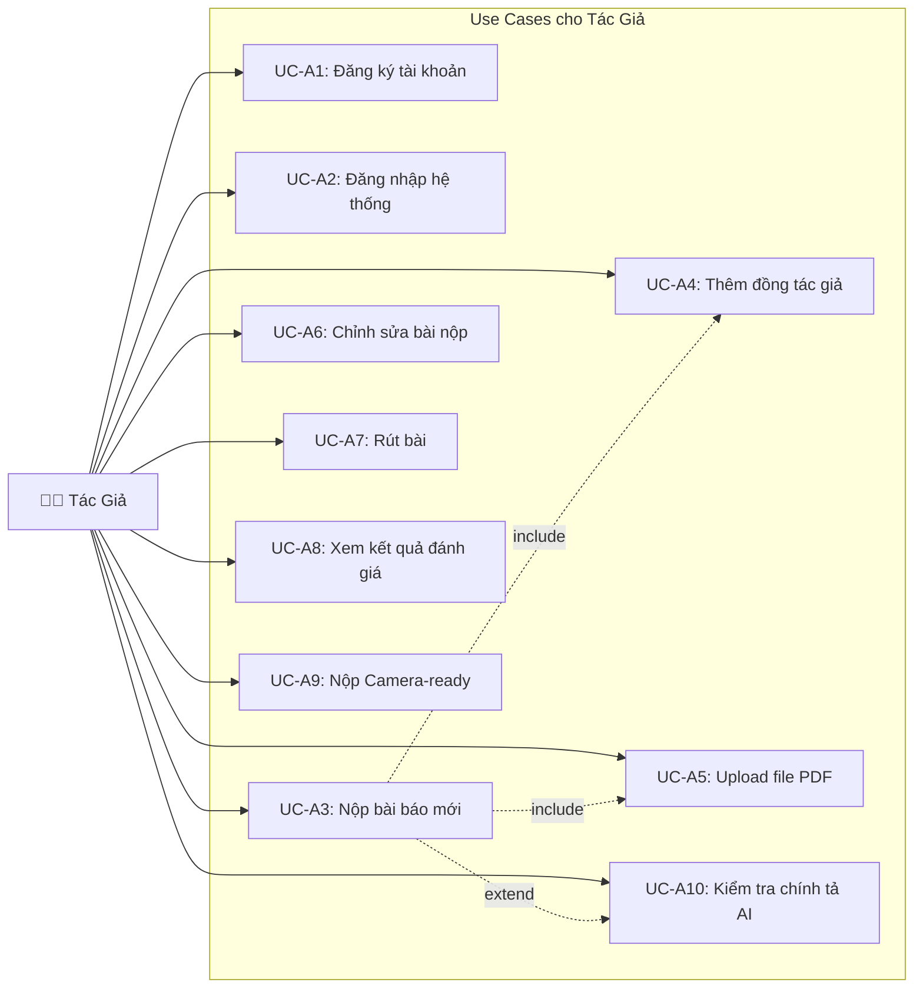
```mermaid
flowchart LR
    Author["🧑‍💻 Tác Giả"]

    subgraph UC_Author["Use Cases cho Tác Giả"]
        UC_A1["UC-A1: Đăng ký tài khoản"]
        UC_A2["UC-A2: Đăng nhập hệ thống"]
        UC_A3["UC-A3: Nộp bài báo mới"]
        UC_A4["UC-A4: Thêm đồng tác giả"]
        UC_A5["UC-A5: Upload file PDF"]
        UC_A6["UC-A6: Chỉnh sửa bài nộp"]
        UC_A7["UC-A7: Rút bài"]
        UC_A8["UC-A8: Xem kết quả đánh giá"]
        UC_A9["UC-A9: Nộp Camera-ready"]
        UC_A10["UC-A10: Kiểm tra chính tả AI"]
    end

    Author --> UC_A1
    Author --> UC_A2
    Author --> UC_A3
    Author --> UC_A4
    Author --> UC_A5
    Author --> UC_A6
    Author --> UC_A7
    Author --> UC_A8
    Author --> UC_A9
    Author --> UC_A10

    UC_A3 -.->|include| UC_A4
    UC_A3 -.->|include| UC_A5
    UC_A3 -.->|extend| UC_A10
```

### 1.3 Use Case Chi Tiết - Người Đánh Giá (Reviewer)

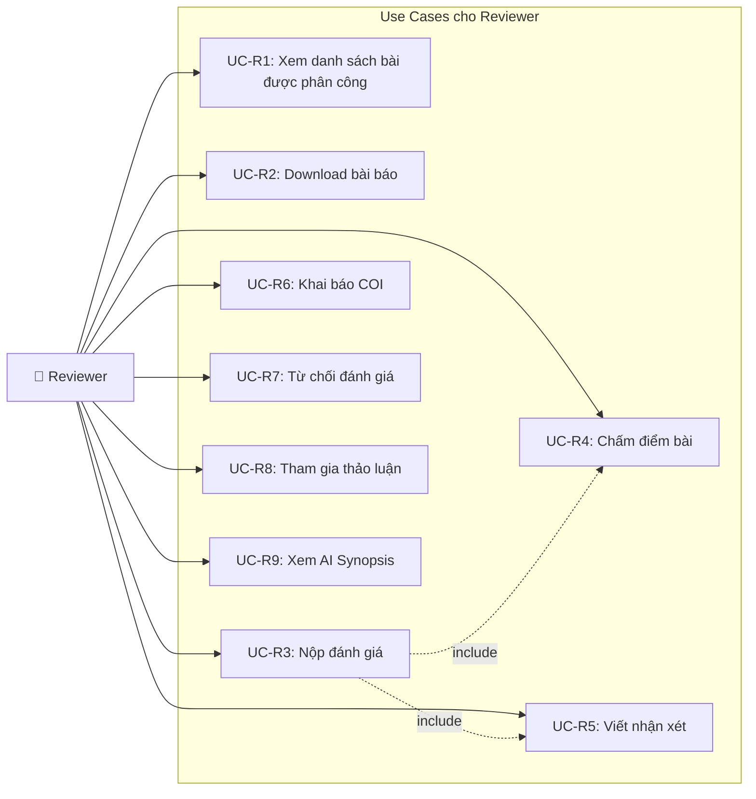
```mermaid
flowchart LR
    Reviewer["📝 Reviewer"]

    subgraph UC_Reviewer["Use Cases cho Reviewer"]
        UC_R1["UC-R1: Xem danh sách bài được phân công"]
        UC_R2["UC-R2: Download bài báo"]
        UC_R3["UC-R3: Nộp đánh giá"]
        UC_R4["UC-R4: Chấm điểm bài"]
        UC_R5["UC-R5: Viết nhận xét"]
        UC_R6["UC-R6: Khai báo COI"]
        UC_R7["UC-R7: Từ chối đánh giá"]
        UC_R8["UC-R8: Tham gia thảo luận"]
        UC_R9["UC-R9: Xem AI Synopsis"]
    end

    Reviewer --> UC_R1
    Reviewer --> UC_R2
    Reviewer --> UC_R3
    Reviewer --> UC_R4
    Reviewer --> UC_R5
    Reviewer --> UC_R6
    Reviewer --> UC_R7
    Reviewer --> UC_R8
    Reviewer --> UC_R9

    UC_R3 -.->|include| UC_R4
    UC_R3 -.->|include| UC_R5
```

### 1.4 Use Case Chi Tiết - Chủ Tịch Hội Nghị (Chair)

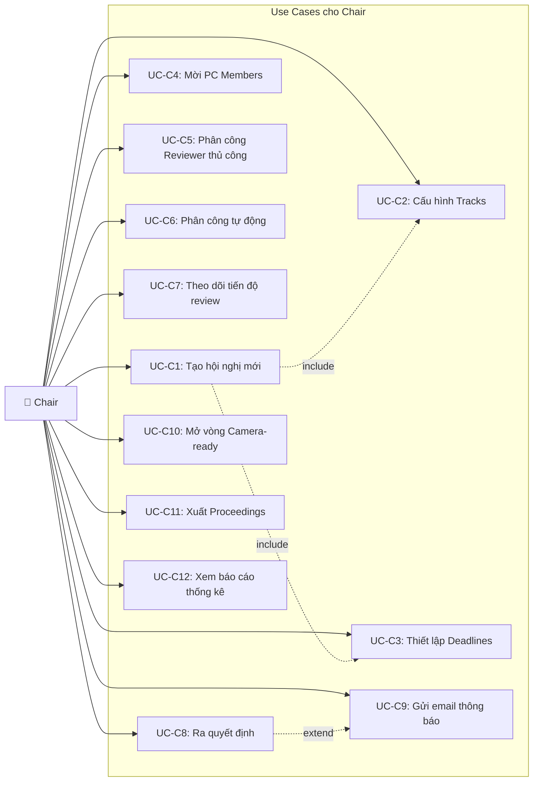
```mermaid
flowchart LR
    Chair["👔 Chair"]

    subgraph UC_Chair["Use Cases cho Chair"]
        UC_C1["UC-C1: Tạo hội nghị mới"]
        UC_C2["UC-C2: Cấu hình Tracks"]
        UC_C3["UC-C3: Thiết lập Deadlines"]
        UC_C4["UC-C4: Mời PC Members"]
        UC_C5["UC-C5: Phân công Reviewer thủ công"]
        UC_C6["UC-C6: Phân công tự động"]
        UC_C7["UC-C7: Theo dõi tiến độ review"]
        UC_C8["UC-C8: Ra quyết định"]
        UC_C9["UC-C9: Gửi email thông báo"]
        UC_C10["UC-C10: Mở vòng Camera-ready"]
        UC_C11["UC-C11: Xuất Proceedings"]
        UC_C12["UC-C12: Xem báo cáo thống kê"]
    end

    Chair --> UC_C1
    Chair --> UC_C2
    Chair --> UC_C3
    Chair --> UC_C4
    Chair --> UC_C5
    Chair --> UC_C6
    Chair --> UC_C7
    Chair --> UC_C8
    Chair --> UC_C9
    Chair --> UC_C10
    Chair --> UC_C11
    Chair --> UC_C12

    UC_C1 -.->|include| UC_C2
    UC_C1 -.->|include| UC_C3
    UC_C8 -.->|extend| UC_C9
```

### 1.5 Use Case Chi Tiết - Quản Trị Viên (Admin)

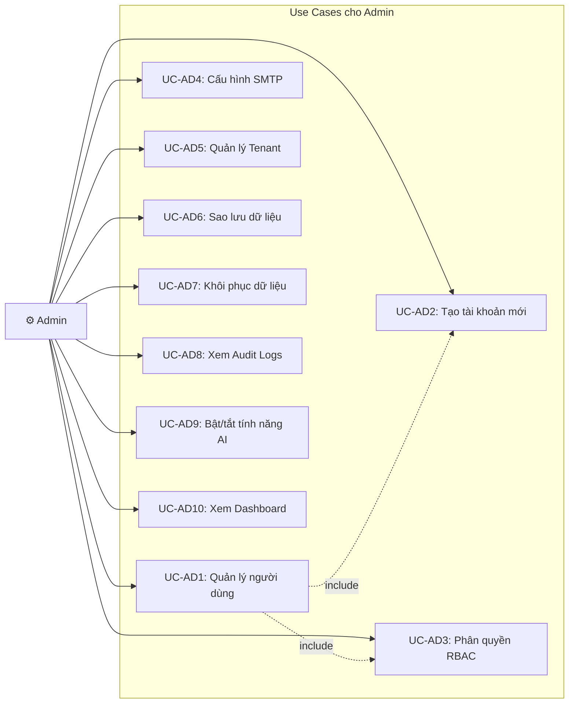
```mermaid
flowchart LR
    Admin["⚙️ Admin"]

    subgraph UC_Admin["Use Cases cho Admin"]
        UC_AD1["UC-AD1: Quản lý người dùng"]
        UC_AD2["UC-AD2: Tạo tài khoản mới"]
        UC_AD3["UC-AD3: Phân quyền RBAC"]
        UC_AD4["UC-AD4: Cấu hình SMTP"]
        UC_AD5["UC-AD5: Quản lý Tenant"]
        UC_AD6["UC-AD6: Sao lưu dữ liệu"]
        UC_AD7["UC-AD7: Khôi phục dữ liệu"]
        UC_AD8["UC-AD8: Xem Audit Logs"]
        UC_AD9["UC-AD9: Bật/tắt tính năng AI"]
        UC_AD10["UC-AD10: Xem Dashboard"]
    end

    Admin --> UC_AD1
    Admin --> UC_AD2
    Admin --> UC_AD3
    Admin --> UC_AD4
    Admin --> UC_AD5
    Admin --> UC_AD6
    Admin --> UC_AD7
    Admin --> UC_AD8
    Admin --> UC_AD9
    Admin --> UC_AD10

    UC_AD1 -.->|include| UC_AD2
    UC_AD1 -.->|include| UC_AD3
```

---

## 2. Sơ Đồ Lớp (Class Diagram)

### 2.1 Sơ Đồ Lớp Tổng Quan - Core Entities

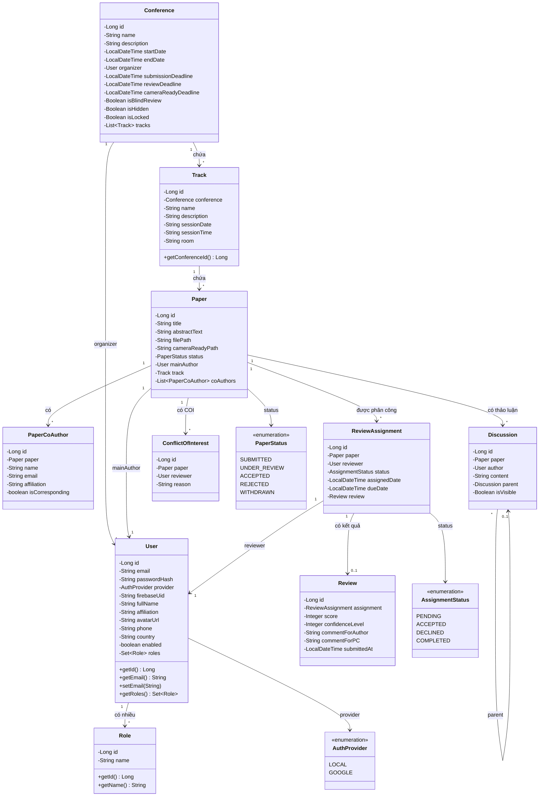
```mermaid
classDiagram
    class User {
        -Long id
        -String email
        -String passwordHash
        -AuthProvider provider
        -String firebaseUid
        -String fullName
        -String affiliation
        -String avatarUrl
        -String phone
        -String country
        -boolean enabled
        -Set~Role~ roles
        +getId() Long
        +getEmail() String
        +setEmail(String)
        +getRoles() Set~Role~
    }

    class Role {
        -Long id
        -String name
        +getId() Long
        +getName() String
    }

    class Conference {
        -Long id
        -String name
        -String description
        -LocalDateTime startDate
        -LocalDateTime endDate
        -User organizer
        -LocalDateTime submissionDeadline
        -LocalDateTime reviewDeadline
        -LocalDateTime cameraReadyDeadline
        -Boolean isBlindReview
        -Boolean isHidden
        -Boolean isLocked
        -List~Track~ tracks
    }

    class Track {
        -Long id
        -Conference conference
        -String name
        -String description
        -String sessionDate
        -String sessionTime
        -String room
        +getConferenceId() Long
    }

    class Paper {
        -Long id
        -String title
        -String abstractText
        -String filePath
        -String cameraReadyPath
        -PaperStatus status
        -User mainAuthor
        -Track track
        -List~PaperCoAuthor~ coAuthors
    }

    class PaperCoAuthor {
        -Long id
        -Paper paper
        -String name
        -String email
        -String affiliation
        -boolean isCorresponding
    }

    class Review {
        -Long id
        -ReviewAssignment assignment
        -Integer score
        -Integer confidenceLevel
        -String commentForAuthor
        -String commentForPC
        -LocalDateTime submittedAt
    }

    class ReviewAssignment {
        -Long id
        -Paper paper
        -User reviewer
        -AssignmentStatus status
        -LocalDateTime assignedDate
        -LocalDateTime dueDate
        -Review review
    }

    class Discussion {
        -Long id
        -Paper paper
        -User author
        -String content
        -Discussion parent
        -Boolean isVisible
    }

    class ConflictOfInterest {
        -Long id
        -Paper paper
        -User reviewer
        -String reason
    }

    %% Enums
    class PaperStatus {
        <<enumeration>>
        SUBMITTED
        UNDER_REVIEW
        ACCEPTED
        REJECTED
        WITHDRAWN
    }

    class AssignmentStatus {
        <<enumeration>>
        PENDING
        ACCEPTED
        DECLINED
        COMPLETED
    }

    class AuthProvider {
        <<enumeration>>
        LOCAL
        GOOGLE
    }

    %% Relationships
    User "1" --> "*" Role : có nhiều
    Conference "1" --> "*" Track : chứa
    Conference "1" --> "1" User : organizer
    Track "1" --> "*" Paper : chứa
    Paper "1" --> "1" User : mainAuthor
    Paper "1" --> "*" PaperCoAuthor : có
    Paper "1" --> "*" ReviewAssignment : được phân công
    Paper "1" --> "*" Discussion : có thảo luận
    Paper "1" --> "*" ConflictOfInterest : có COI
    ReviewAssignment "1" --> "1" User : reviewer
    ReviewAssignment "1" --> "0..1" Review : có kết quả
    Discussion "*" --> "0..1" Discussion : parent
    Paper --> PaperStatus : status
    ReviewAssignment --> AssignmentStatus : status
    User --> AuthProvider : provider
```

### 2.2 Sơ Đồ Lớp - AI & Hệ Thống

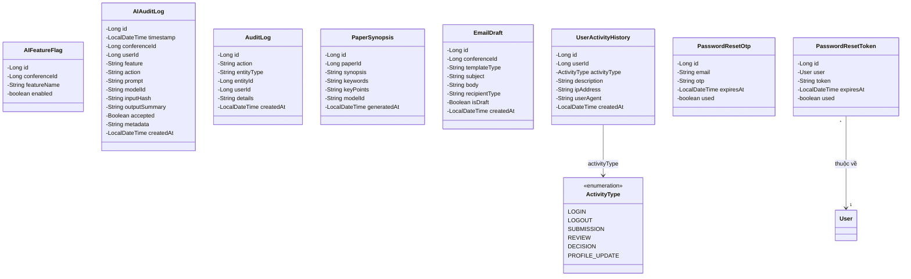
```mermaid
classDiagram
    class AIFeatureFlag {
        -Long id
        -Long conferenceId
        -String featureName
        -boolean enabled
    }

    class AIAuditLog {
        -Long id
        -LocalDateTime timestamp
        -Long conferenceId
        -Long userId
        -String feature
        -String action
        -String prompt
        -String modelId
        -String inputHash
        -String outputSummary
        -Boolean accepted
        -String metadata
        -LocalDateTime createdAt
    }

    class AuditLog {
        -Long id
        -String action
        -String entityType
        -Long entityId
        -Long userId
        -String details
        -LocalDateTime createdAt
    }

    class PaperSynopsis {
        -Long id
        -Long paperId
        -String synopsis
        -String keywords
        -String keyPoints
        -String modelId
        -LocalDateTime generatedAt
    }

    class EmailDraft {
        -Long id
        -Long conferenceId
        -String templateType
        -String subject
        -String body
        -String recipientType
        -Boolean isDraft
        -LocalDateTime createdAt
    }

    class UserActivityHistory {
        -Long id
        -Long userId
        -ActivityType activityType
        -String description
        -String ipAddress
        -String userAgent
        -LocalDateTime createdAt
    }

    class PasswordResetOtp {
        -Long id
        -String email
        -String otp
        -LocalDateTime expiresAt
        -boolean used
    }

    class PasswordResetToken {
        -Long id
        -User user
        -String token
        -LocalDateTime expiresAt
        -boolean used
    }

    class ActivityType {
        <<enumeration>>
        LOGIN
        LOGOUT
        SUBMISSION
        REVIEW
        DECISION
        PROFILE_UPDATE
    }

    UserActivityHistory --> ActivityType : activityType
    PasswordResetToken "*" --> "1" User : thuộc về
```

### 2.3 Sơ Đồ Lớp - Repository Layer

```mermaid
classDiagram
    class UserRepository {
        <<interface>>
        +findByEmail(String email) Optional~User~
        +existsByEmail(String email) boolean
    }

    class ConferenceRepository {
        <<interface>>
        +findByOrganizerId(Long userId) List~Conference~
        +findByIsHiddenFalse() List~Conference~
    }

    class PaperRepository {
        <<interface>>
        +findByMainAuthorId(Long userId) List~Paper~
        +findByTrackConferenceId(Long confId) List~Paper~
        +findByStatus(PaperStatus status) List~Paper~
    }

    class ReviewRepository {
        <<interface>>
        +findByAssignmentId(Long assignmentId) Optional~Review~
        +findByAssignmentReviewerId(Long reviewerId) List~Review~
    }

    class ReviewAssignmentRepository {
        <<interface>>
        +findByReviewerId(Long reviewerId) List~ReviewAssignment~
        +findByPaperId(Long paperId) List~ReviewAssignment~
    }

    class TrackRepository {
        <<interface>>
        +findByConferenceId(Long conferenceId) List~Track~
    }

    class DiscussionRepository {
        <<interface>>
        +findByPaperId(Long paperId) List~Discussion~
        +findByPaperIdAndParentIsNull(Long paperId) List~Discussion~
    }

    class AIAuditLogRepository {
        <<interface>>
        +findByConferenceId(Long conferenceId) List~AIAuditLog~
        +findByUserId(Long userId) List~AIAuditLog~
    }

    UserRepository --|> JpaRepository
    ConferenceRepository --|> JpaRepository
    PaperRepository --|> JpaRepository
    ReviewRepository --|> JpaRepository
    ReviewAssignmentRepository --|> JpaRepository
    TrackRepository --|> JpaRepository
    DiscussionRepository --|> JpaRepository
    AIAuditLogRepository --|> JpaRepository
```

---

## 3. Sơ Đồ Tuần Tự (Sequence Diagram)

### 3.1 Sequence Diagram - Đăng Ký & Đăng Nhập

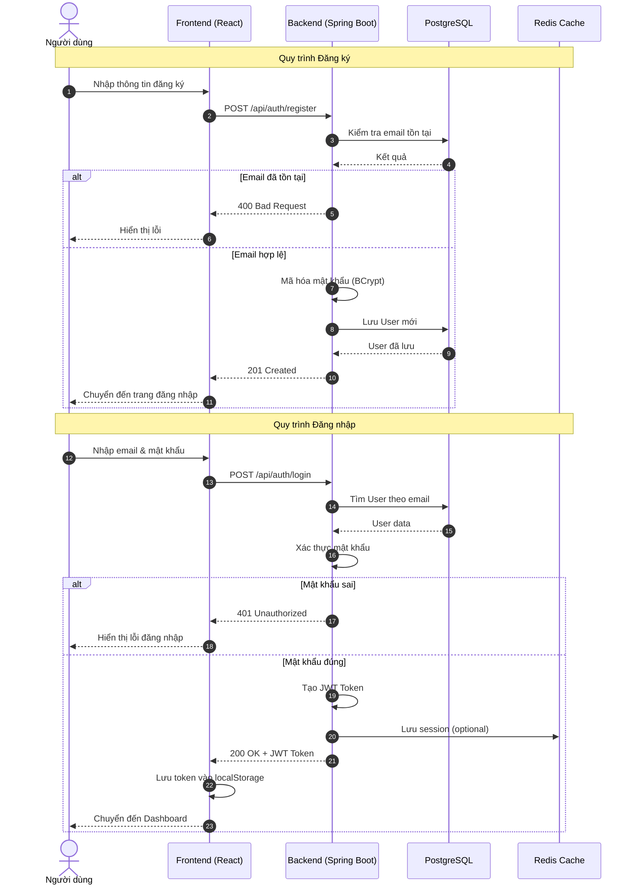
```mermaid
sequenceDiagram
    autonumber
    actor User as Người dùng
    participant FE as Frontend (React)
    participant BE as Backend (Spring Boot)
    participant DB as PostgreSQL
    participant Redis as Redis Cache

    Note over User,Redis: Quy trình Đăng ký
    User->>FE: Nhập thông tin đăng ký
    FE->>BE: POST /api/auth/register
    BE->>DB: Kiểm tra email tồn tại
    DB-->>BE: Kết quả
    alt Email đã tồn tại
        BE-->>FE: 400 Bad Request
        FE-->>User: Hiển thị lỗi
    else Email hợp lệ
        BE->>BE: Mã hóa mật khẩu (BCrypt)
        BE->>DB: Lưu User mới
        DB-->>BE: User đã lưu
        BE-->>FE: 201 Created
        FE-->>User: Chuyển đến trang đăng nhập
    end

    Note over User,Redis: Quy trình Đăng nhập
    User->>FE: Nhập email & mật khẩu
    FE->>BE: POST /api/auth/login
    BE->>DB: Tìm User theo email
    DB-->>BE: User data
    BE->>BE: Xác thực mật khẩu
    alt Mật khẩu sai
        BE-->>FE: 401 Unauthorized
        FE-->>User: Hiển thị lỗi đăng nhập
    else Mật khẩu đúng
        BE->>BE: Tạo JWT Token
        BE->>Redis: Lưu session (optional)
        BE-->>FE: 200 OK + JWT Token
        FE->>FE: Lưu token vào localStorage
        FE-->>User: Chuyển đến Dashboard
    end
```

### 3.2 Sequence Diagram - Nộp Bài Báo

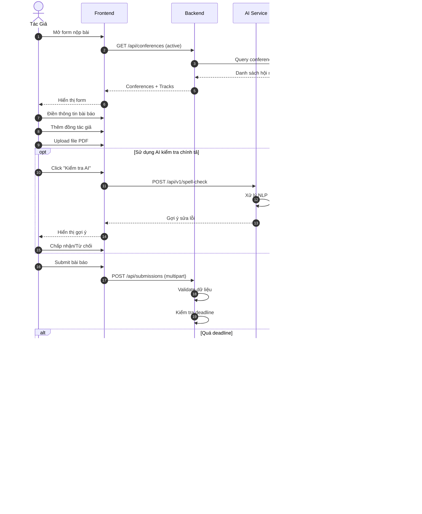
```mermaid
sequenceDiagram
    autonumber
    actor Author as Tác Giả
    participant FE as Frontend
    participant BE as Backend
    participant AI as AI Service
    participant DB as PostgreSQL
    participant Storage as File Storage

    Author->>FE: Mở form nộp bài
    FE->>BE: GET /api/conferences (active)
    BE->>DB: Query conferences
    DB-->>BE: Danh sách hội nghị
    BE-->>FE: Conferences + Tracks
    FE-->>Author: Hiển thị form

    Author->>FE: Điền thông tin bài báo
    Author->>FE: Thêm đồng tác giả
    Author->>FE: Upload file PDF

    opt Sử dụng AI kiểm tra chính tả
        Author->>FE: Click "Kiểm tra AI"
        FE->>AI: POST /api/v1/spell-check
        AI->>AI: Xử lý NLP
        AI-->>FE: Gợi ý sửa lỗi
        FE-->>Author: Hiển thị gợi ý
        Author->>FE: Chấp nhận/Từ chối
    end

    Author->>FE: Submit bài báo
    FE->>BE: POST /api/submissions (multipart)
    BE->>BE: Validate dữ liệu
    BE->>BE: Kiểm tra deadline

    alt Quá deadline
        BE-->>FE: 400 Bad Request
        FE-->>Author: Thông báo hết hạn
    else Còn deadline
        BE->>Storage: Lưu file PDF
        Storage-->>BE: File path
        BE->>DB: Lưu Paper + CoAuthors
        DB-->>BE: Paper đã lưu
        BE->>DB: Lưu AuditLog
        BE-->>FE: 201 Created
        FE-->>Author: Thông báo thành công
    end
```

### 3.3 Sequence Diagram - Quy Trình Review

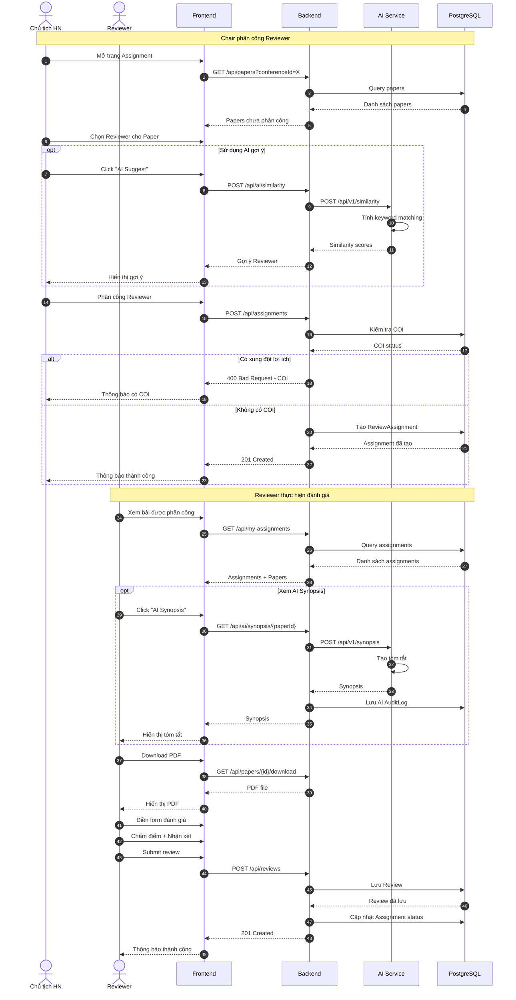
```mermaid
sequenceDiagram
    autonumber
    actor Chair as Chủ tịch HN
    actor Reviewer as Reviewer
    participant FE as Frontend
    participant BE as Backend
    participant AI as AI Service
    participant DB as PostgreSQL

    Note over Chair,DB: Chair phân công Reviewer
    Chair->>FE: Mở trang Assignment
    FE->>BE: GET /api/papers?conferenceId=X
    BE->>DB: Query papers
    DB-->>BE: Danh sách papers
    BE-->>FE: Papers chưa phân công

    Chair->>FE: Chọn Reviewer cho Paper

    opt Sử dụng AI gợi ý
        Chair->>FE: Click "AI Suggest"
        FE->>BE: POST /api/ai/similarity
        BE->>AI: POST /api/v1/similarity
        AI->>AI: Tính keyword matching
        AI-->>BE: Similarity scores
        BE-->>FE: Gợi ý Reviewer
        FE-->>Chair: Hiển thị gợi ý
    end

    Chair->>FE: Phân công Reviewer
    FE->>BE: POST /api/assignments
    BE->>DB: Kiểm tra COI
    DB-->>BE: COI status
    alt Có xung đột lợi ích
        BE-->>FE: 400 Bad Request - COI
        FE-->>Chair: Thông báo có COI
    else Không có COI
        BE->>DB: Tạo ReviewAssignment
        DB-->>BE: Assignment đã tạo
        BE-->>FE: 201 Created
        FE-->>Chair: Thông báo thành công
    end

    Note over Reviewer,DB: Reviewer thực hiện đánh giá
    Reviewer->>FE: Xem bài được phân công
    FE->>BE: GET /api/my-assignments
    BE->>DB: Query assignments
    DB-->>BE: Danh sách assignments
    BE-->>FE: Assignments + Papers

    opt Xem AI Synopsis
        Reviewer->>FE: Click "AI Synopsis"
        FE->>BE: GET /api/ai/synopsis/{paperId}
        BE->>AI: POST /api/v1/synopsis
        AI->>AI: Tạo tóm tắt
        AI-->>BE: Synopsis
        BE->>DB: Lưu AI AuditLog
        BE-->>FE: Synopsis
        FE-->>Reviewer: Hiển thị tóm tắt
    end

    Reviewer->>FE: Download PDF
    FE->>BE: GET /api/papers/{id}/download
    BE-->>FE: PDF file
    FE-->>Reviewer: Hiển thị PDF

    Reviewer->>FE: Điền form đánh giá
    Reviewer->>FE: Chấm điểm + Nhận xét
    Reviewer->>FE: Submit review
    FE->>BE: POST /api/reviews
    BE->>DB: Lưu Review
    DB-->>BE: Review đã lưu
    BE->>DB: Cập nhật Assignment status
    BE-->>FE: 201 Created
    FE-->>Reviewer: Thông báo thành công
```

### 3.4 Sequence Diagram - Ra Quyết Định

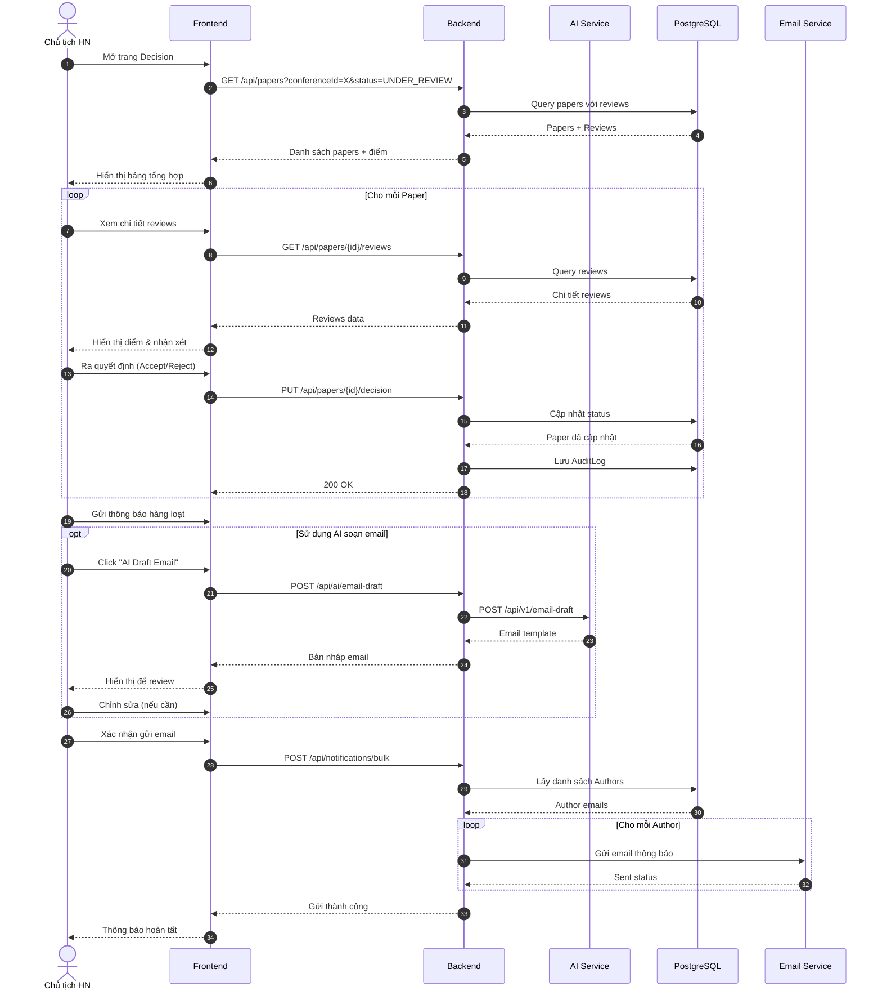
```mermaid
sequenceDiagram
    autonumber
    actor Chair as Chủ tịch HN
    participant FE as Frontend
    participant BE as Backend
    participant AI as AI Service
    participant DB as PostgreSQL
    participant Email as Email Service

    Chair->>FE: Mở trang Decision
    FE->>BE: GET /api/papers?conferenceId=X&status=UNDER_REVIEW
    BE->>DB: Query papers với reviews
    DB-->>BE: Papers + Reviews
    BE-->>FE: Danh sách papers + điểm

    FE-->>Chair: Hiển thị bảng tổng hợp

    loop Cho mỗi Paper
        Chair->>FE: Xem chi tiết reviews
        FE->>BE: GET /api/papers/{id}/reviews
        BE->>DB: Query reviews
        DB-->>BE: Chi tiết reviews
        BE-->>FE: Reviews data
        FE-->>Chair: Hiển thị điểm & nhận xét

        Chair->>FE: Ra quyết định (Accept/Reject)
        FE->>BE: PUT /api/papers/{id}/decision
        BE->>DB: Cập nhật status
        DB-->>BE: Paper đã cập nhật
        BE->>DB: Lưu AuditLog
        BE-->>FE: 200 OK
    end

    Chair->>FE: Gửi thông báo hàng loạt

    opt Sử dụng AI soạn email
        Chair->>FE: Click "AI Draft Email"
        FE->>BE: POST /api/ai/email-draft
        BE->>AI: POST /api/v1/email-draft
        AI-->>BE: Email template
        BE-->>FE: Bản nháp email
        FE-->>Chair: Hiển thị để review
        Chair->>FE: Chỉnh sửa (nếu cần)
    end

    Chair->>FE: Xác nhận gửi email
    FE->>BE: POST /api/notifications/bulk
    BE->>DB: Lấy danh sách Authors
    DB-->>BE: Author emails

    loop Cho mỗi Author
        BE->>Email: Gửi email thông báo
        Email-->>BE: Sent status
    end

    BE-->>FE: Gửi thành công
    FE-->>Chair: Thông báo hoàn tất
```

---

## 4. Sơ Đồ Hoạt Động (Activity Diagram)

### 4.1 Activity Diagram - Workflow Tổng Thể Hội Nghị

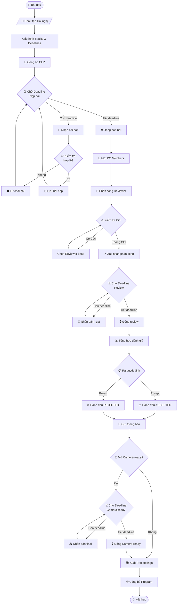
```mermaid
flowchart TD
    Start([🚀 Bắt đầu]) --> CreateConf[/👔 Chair tạo Hội nghị/]
    CreateConf --> ConfigTracks[Cấu hình Tracks & Deadlines]
    ConfigTracks --> PublishCFP[📢 Công bố CFP]
    PublishCFP --> WaitSubmission{⏳ Chờ Deadline<br/>Nộp bài}

    WaitSubmission -->|Còn deadline| ReceiveSubmission[📄 Nhận bài nộp]
    ReceiveSubmission --> ValidateSubmission{✅ Kiểm tra<br/>hợp lệ?}
    ValidateSubmission -->|Không| RejectSubmission[❌ Từ chối bài]
    RejectSubmission --> WaitSubmission
    ValidateSubmission -->|Có| SaveSubmission[💾 Lưu bài nộp]
    SaveSubmission --> WaitSubmission

    WaitSubmission -->|Hết deadline| CloseSubmission[🔒 Đóng nộp bài]
    CloseSubmission --> InvitePC[📨 Mời PC Members]
    InvitePC --> AssignReviewers[👥 Phân công Reviewer]

    AssignReviewers --> CheckCOI{⚠️ Kiểm tra COI}
    CheckCOI -->|Có COI| SelectOther[Chọn Reviewer khác]
    SelectOther --> CheckCOI
    CheckCOI -->|Không COI| ConfirmAssignment[✓ Xác nhận phân công]

    ConfirmAssignment --> WaitReview{⏳ Chờ Deadline<br/>Review}

    WaitReview -->|Còn deadline| ReceiveReview[📝 Nhận đánh giá]
    ReceiveReview --> WaitReview

    WaitReview -->|Hết deadline| CloseReview[🔒 Đóng review]
    CloseReview --> AggregateReviews[📊 Tổng hợp đánh giá]

    AggregateReviews --> MakeDecision{📋 Ra quyết định}
    MakeDecision -->|Accept| MarkAccepted[✅ Đánh dấu ACCEPTED]
    MakeDecision -->|Reject| MarkRejected[❌ Đánh dấu REJECTED]

    MarkAccepted --> SendNotification
    MarkRejected --> SendNotification

    SendNotification[📧 Gửi thông báo] --> OpenCameraReady{🎯 Mở Camera-ready?}

    OpenCameraReady -->|Có| WaitCameraReady{⏳ Chờ Deadline<br/>Camera-ready}
    WaitCameraReady -->|Còn deadline| ReceiveCR[📤 Nhận bản final]
    ReceiveCR --> WaitCameraReady
    WaitCameraReady -->|Hết deadline| CloseCR[🔒 Đóng Camera-ready]

    OpenCameraReady -->|Không| ExportProceedings
    CloseCR --> ExportProceedings[📚 Xuất Proceedings]

    ExportProceedings --> PublishProgram[🌐 Công bố Program]
    PublishProgram --> End([🏁 Kết thúc])
```

### 4.2 Activity Diagram - Quy Trình Nộp Bài

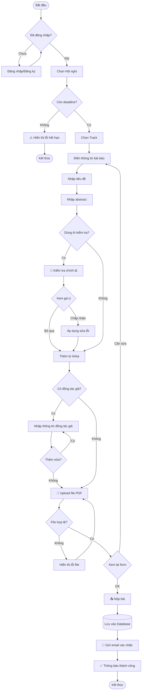
```mermaid
flowchart TD
    Start([Bắt đầu]) --> Login{Đã đăng nhập?}
    Login -->|Chưa| GoLogin[Đăng nhập/Đăng ký]
    GoLogin --> Login
    Login -->|Rồi| SelectConf[Chọn Hội nghị]

    SelectConf --> CheckDeadline{Còn deadline?}
    CheckDeadline -->|Không| ShowError[⚠️ Hiển thị lỗi hết hạn]
    ShowError --> End1([Kết thúc])

    CheckDeadline -->|Có| SelectTrack[Chọn Track]
    SelectTrack --> FillForm[Điền thông tin bài báo]
    FillForm --> AddTitle[Nhập tiêu đề]
    AddTitle --> AddAbstract[Nhập abstract]

    AddAbstract --> UseAI{Dùng AI kiểm tra?}
    UseAI -->|Có| SpellCheck[🤖 Kiểm tra chính tả]
    SpellCheck --> ReviewSuggestions{Xem gợi ý}
    ReviewSuggestions -->|Chấp nhận| ApplySuggestions[Áp dụng sửa lỗi]
    ReviewSuggestions -->|Bỏ qua| AddKeywords
    ApplySuggestions --> AddKeywords
    UseAI -->|Không| AddKeywords

    AddKeywords[Thêm từ khóa] --> AddCoAuthors{Có đồng tác giả?}
    AddCoAuthors -->|Có| FillCoAuthor[Nhập thông tin đồng tác giả]
    FillCoAuthor --> MoreCoAuthors{Thêm nữa?}
    MoreCoAuthors -->|Có| FillCoAuthor
    MoreCoAuthors -->|Không| UploadPDF
    AddCoAuthors -->|Không| UploadPDF

    UploadPDF[📎 Upload file PDF] --> ValidateFile{File hợp lệ?}
    ValidateFile -->|Không| ShowFileError[Hiển thị lỗi file]
    ShowFileError --> UploadPDF
    ValidateFile -->|Có| ReviewForm{Xem lại form}

    ReviewForm -->|Cần sửa| FillForm
    ReviewForm -->|OK| SubmitPaper[📤 Nộp bài]

    SubmitPaper --> SaveDB[(Lưu vào Database)]
    SaveDB --> SendConfirmation[📧 Gửi email xác nhận]
    SendConfirmation --> ShowSuccess[✅ Thông báo thành công]
    ShowSuccess --> End2([Kết thúc])
```

### 4.3 Activity Diagram - Quy Trình Review

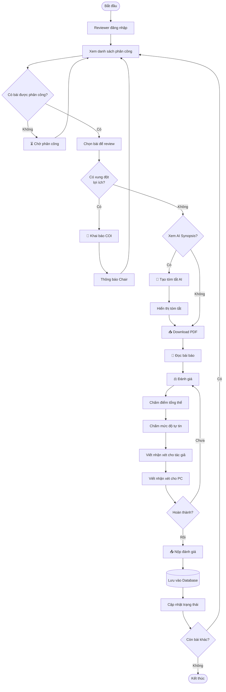
```mermaid
flowchart TD
    Start([Bắt đầu]) --> LoginReviewer[Reviewer đăng nhập]
    LoginReviewer --> ViewAssignments[Xem danh sách phân công]

    ViewAssignments --> HasAssignments{Có bài được phân công?}
    HasAssignments -->|Không| WaitAssignment[⏳ Chờ phân công]
    WaitAssignment --> ViewAssignments

    HasAssignments -->|Có| SelectPaper[Chọn bài để review]
    SelectPaper --> CheckCOI{Có xung đột<br/>lợi ích?}

    CheckCOI -->|Có| DeclareCOI[📝 Khai báo COI]
    DeclareCOI --> NotifyChair[Thông báo Chair]
    NotifyChair --> ViewAssignments

    CheckCOI -->|Không| ViewSynopsis{Xem AI Synopsis?}
    ViewSynopsis -->|Có| GenerateSynopsis[🤖 Tạo tóm tắt AI]
    GenerateSynopsis --> DisplaySynopsis[Hiển thị tóm tắt]
    DisplaySynopsis --> DownloadPaper
    ViewSynopsis -->|Không| DownloadPaper

    DownloadPaper[📥 Download PDF] --> ReadPaper[📖 Đọc bài báo]
    ReadPaper --> EvaluatePaper[⚖️ Đánh giá]

    EvaluatePaper --> FillScore[Chấm điểm tổng thể]
    FillScore --> FillConfidence[Chấm mức độ tự tin]
    FillConfidence --> WriteAuthorComment[Viết nhận xét cho tác giả]
    WriteAuthorComment --> WritePCComment[Viết nhận xét cho PC]

    WritePCComment --> ReviewComplete{Hoàn thành?}
    ReviewComplete -->|Chưa| EvaluatePaper
    ReviewComplete -->|Rồi| SubmitReview[📤 Nộp đánh giá]

    SubmitReview --> SaveReview[(Lưu vào Database)]
    SaveReview --> UpdateStatus[Cập nhật trạng thái]
    UpdateStatus --> MorePapers{Còn bài khác?}

    MorePapers -->|Có| ViewAssignments
    MorePapers -->|Không| End([Kết thúc])
```

---

## 5. Sơ Đồ Thành Phần (Component Diagram)

### 5.1 Component Diagram - Kiến Trúc Tổng Thể

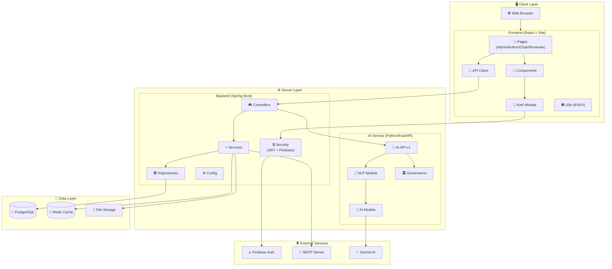
```mermaid
flowchart TB
    subgraph Client["🖥️ Client Layer"]
        Browser["🌐 Web Browser"]
        subgraph FE["Frontend (React + Vite)"]
            Pages["📄 Pages<br/>(Admin/Author/Chair/Reviewer)"]
            Components["🧩 Components"]
            API_Client["📡 API Client"]
            Auth_Module["🔐 Auth Module"]
            I18n["🌍 i18n (EN/VI)"]
        end
    end

    subgraph Server["⚙️ Server Layer"]
        subgraph Backend["Backend (Spring Boot)"]
            Controllers["🎮 Controllers"]
            Services["⚡ Services"]
            Repositories["📚 Repositories"]
            Security["🔒 Security<br/>(JWT + Firebase)"]
            Config["⚙️ Config"]
        end

        subgraph AI["AI Service (Python/FastAPI)"]
            AI_API["🤖 AI API v1"]
            NLP["📝 NLP Module"]
            Governance["🏛️ Governance"]
            AI_Models["🧠 AI Models"]
        end
    end

    subgraph Data["💾 Data Layer"]
        PostgreSQL[("🐘 PostgreSQL")]
        Redis[("📮 Redis Cache")]
        FileStorage["📁 File Storage"]
    end

    subgraph External["🌐 External Services"]
        Firebase["🔥 Firebase Auth"]
        SMTP["📧 SMTP Server"]
        Gemini["✨ Gemini AI"]
    end

    Browser --> FE
    Pages --> Components
    Pages --> API_Client
    Components --> Auth_Module
    API_Client --> Controllers
    Auth_Module --> Security

    Controllers --> Services
    Services --> Repositories
    Repositories --> PostgreSQL
    Services --> Redis
    Services --> FileStorage

    Controllers --> AI_API
    AI_API --> NLP
    AI_API --> Governance
    NLP --> AI_Models
    AI_Models --> Gemini

    Security --> Firebase
    Services --> SMTP
```

### 5.2 Component Diagram - Backend Chi Tiết

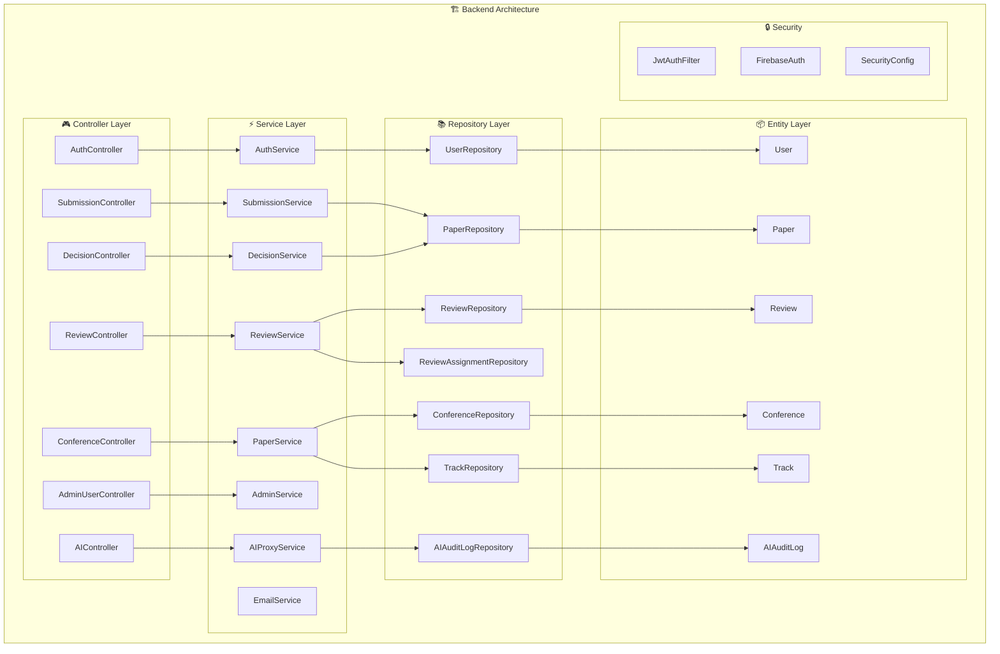
```mermaid
flowchart TB
    subgraph Backend["🏗️ Backend Architecture"]
        subgraph Controllers["🎮 Controller Layer"]
            AuthController["AuthController"]
            SubmissionController["SubmissionController"]
            ReviewController["ReviewController"]
            DecisionController["DecisionController"]
            ConferenceController["ConferenceController"]
            AdminUserController["AdminUserController"]
            AIController["AIController"]
        end

        subgraph Services["⚡ Service Layer"]
            AuthService["AuthService"]
            SubmissionService["SubmissionService"]
            ReviewService["ReviewService"]
            DecisionService["DecisionService"]
            PaperService["PaperService"]
            AdminService["AdminService"]
            AIProxyService["AIProxyService"]
            EmailService["EmailService"]
        end

        subgraph Repositories["📚 Repository Layer"]
            UserRepository["UserRepository"]
            PaperRepository["PaperRepository"]
            ReviewRepository["ReviewRepository"]
            ReviewAssignmentRepository["ReviewAssignmentRepository"]
            ConferenceRepository["ConferenceRepository"]
            TrackRepository["TrackRepository"]
            AIAuditLogRepository["AIAuditLogRepository"]
        end

        subgraph Entity["📦 Entity Layer"]
            User["User"]
            Paper["Paper"]
            Review["Review"]
            Conference["Conference"]
            Track["Track"]
            AIAuditLog["AIAuditLog"]
        end

        subgraph Security["🔒 Security"]
            JwtFilter["JwtAuthFilter"]
            FirebaseAuth["FirebaseAuth"]
            SecurityConfig["SecurityConfig"]
        end
    end

    AuthController --> AuthService
    SubmissionController --> SubmissionService
    ReviewController --> ReviewService
    DecisionController --> DecisionService
    ConferenceController --> PaperService
    AdminUserController --> AdminService
    AIController --> AIProxyService

    AuthService --> UserRepository
    SubmissionService --> PaperRepository
    ReviewService --> ReviewRepository
    ReviewService --> ReviewAssignmentRepository
    DecisionService --> PaperRepository
    PaperService --> ConferenceRepository
    PaperService --> TrackRepository
    AIProxyService --> AIAuditLogRepository

    UserRepository --> User
    PaperRepository --> Paper
    ReviewRepository --> Review
    ConferenceRepository --> Conference
    TrackRepository --> Track
    AIAuditLogRepository --> AIAuditLog
```

### 5.3 Component Diagram - Frontend Chi Tiết

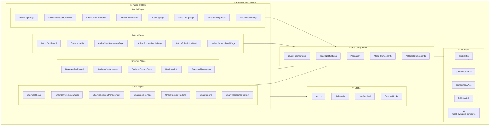
```mermaid
flowchart TB
    subgraph Frontend["🎨 Frontend Architecture"]
        subgraph Pages["📄 Pages by Role"]
            subgraph Admin["Admin Pages"]
                AdminLogin["AdminLoginPage"]
                AdminDashboard["AdminDashboardOverview"]
                AdminUsers["AdminUserCreate/Edit"]
                AdminConf["AdminConferences"]
                AuditLog["AuditLogPage"]
                SmtpConfig["SmtpConfigPage"]
                TenantMgmt["TenantManagement"]
                AIGovern["AiGovernancePage"]
            end

            subgraph Author["Author Pages"]
                AuthorDash["AuthorDashboard"]
                ConfList["ConferenceList"]
                NewSubmission["AuthorNewSubmissionPage"]
                SubmissionList["AuthorSubmissionListPage"]
                SubmissionDetail["AuthorSubmissionDetail"]
                CameraReady["AuthorCameraReadyPage"]
            end

            subgraph Reviewer["Reviewer Pages"]
                ReviewerDash["ReviewerDashboard"]
                Assignments["ReviewerAssignments"]
                ReviewForm["ReviewerReviewForm"]
                COIPage["ReviewerCOI"]
                Discussions["ReviewerDiscussions"]
            end

            subgraph Chair["Chair Pages"]
                ChairDash["ChairDashboard"]
                ConfMgr["ChairConferenceManager"]
                AssignMgmt["ChairAssignmentManagement"]
                Decision["ChairDecisionPage"]
                Progress["ChairProgressTracking"]
                Reports["ChairReports"]
                Proceedings["ChairProceedingsPreview"]
            end
        end

        subgraph Components["🧩 Shared Components"]
            Layout["Layout Components"]
            Toast["Toast Notifications"]
            Pagination["Pagination"]
            Modal["Modal Components"]
            AIModals["AI Modal Components"]
        end

        subgraph API["📡 API Layer"]
            apiClient["apiClient.js"]
            submissionAPI["submissionAPI.js"]
            conferenceAPI["conferenceAPI.js"]
            historyApi["historyApi.js"]
            aiAPI["ai/\n(spell, synopsis, similarity)"]
        end

        subgraph Utils["🛠️ Utilities"]
            auth["auth.js"]
            firebase["firebase.js"]
            i18n["i18n (locales)"]
            hooks["Custom Hooks"]
        end
    end

    Admin --> Components
    Author --> Components
    Reviewer --> Components
    Chair --> Components

    Components --> API
    Pages --> Utils
    API --> apiClient
```

### 5.4 Component Diagram - Docker Deployment

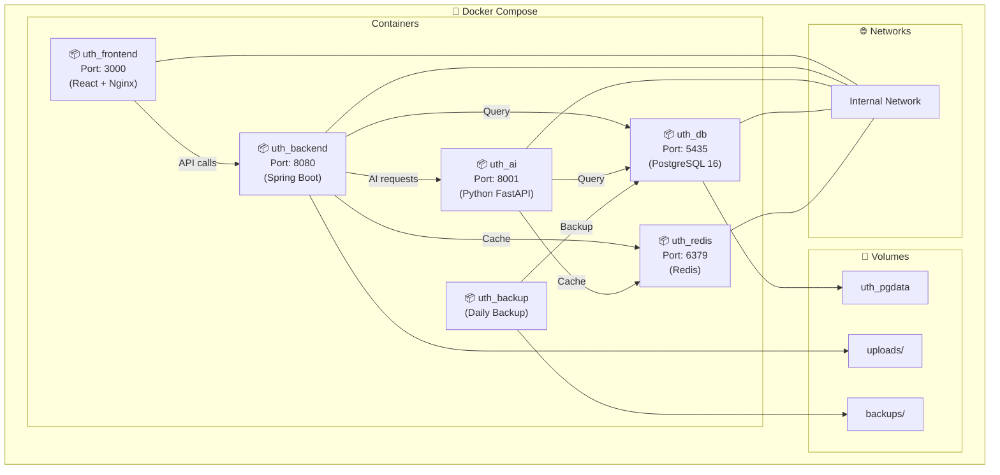
```mermaid
flowchart TB
    subgraph Docker["🐳 Docker Compose"]
        subgraph Containers["Containers"]
            uth_frontend["📦 uth_frontend<br/>Port: 3000<br/>(React + Nginx)"]
            uth_backend["📦 uth_backend<br/>Port: 8080<br/>(Spring Boot)"]
            uth_ai["📦 uth_ai<br/>Port: 8001<br/>(Python FastAPI)"]
            uth_db["📦 uth_db<br/>Port: 5435<br/>(PostgreSQL 16)"]
            uth_redis["📦 uth_redis<br/>Port: 6379<br/>(Redis)"]
            uth_backup["📦 uth_backup<br/>(Daily Backup)"]
        end

        subgraph Volumes["💾 Volumes"]
            pgdata["uth_pgdata"]
            uploads["uploads/"]
            backups["backups/"]
        end

        subgraph Networks["🌐 Networks"]
            internal["Internal Network"]
        end
    end

    uth_frontend -->|API calls| uth_backend
    uth_backend -->|AI requests| uth_ai
    uth_backend -->|Query| uth_db
    uth_backend -->|Cache| uth_redis
    uth_ai -->|Query| uth_db
    uth_ai -->|Cache| uth_redis
    uth_backup -->|Backup| uth_db

    uth_db --> pgdata
    uth_backend --> uploads
    uth_backup --> backups

    uth_frontend --- internal
    uth_backend --- internal
    uth_ai --- internal
    uth_db --- internal
    uth_redis --- internal
```

---

## 6. Bảng Tổng Hợp

### 6.1 Tổng Hợp Entities

| Entity             | Mô tả                                    | Quan hệ chính                   |
| ------------------ | ---------------------------------------- | ------------------------------- |
| User               | Người dùng hệ thống                      | Many-to-Many với Role           |
| Role               | Vai trò (ADMIN, CHAIR, REVIEWER, AUTHOR) | Many-to-Many với User           |
| Conference         | Hội nghị khoa học                        | One-to-Many với Track           |
| Track              | Chủ đề/phân ban                          | Many-to-One với Conference      |
| Paper              | Bài báo nộp                              | Many-to-One với User, Track     |
| PaperCoAuthor      | Đồng tác giả                             | Many-to-One với Paper           |
| ReviewAssignment   | Phân công đánh giá                       | Many-to-One với Paper, User     |
| Review             | Kết quả đánh giá                         | One-to-One với ReviewAssignment |
| Discussion         | Thảo luận PC                             | Many-to-One với Paper           |
| ConflictOfInterest | Xung đột lợi ích                         | Many-to-One với Paper, User     |
| AIFeatureFlag      | Cờ tính năng AI                          | -                               |
| AIAuditLog         | Nhật ký AI                               | -                               |

### 6.2 Tổng Hợp Use Cases

| Actor    | Số lượng UC | UC chính                           |
| -------- | ----------- | ---------------------------------- |
| Author   | 10          | Nộp bài, Xem kết quả, Camera-ready |
| Reviewer | 9           | Đánh giá, COI, Thảo luận           |
| Chair    | 12          | Quản lý HN, Phân công, Quyết định  |
| Admin    | 10          | Quản lý user, RBAC, Backup         |

### 6.3 Tech Stack

| Layer      | Technology        | Mô tả                   |
| ---------- | ----------------- | ----------------------- |
| Frontend   | React 18 + Vite   | Single Page Application |
| Backend    | Spring Boot 3.5.9 | REST API Server         |
| AI Service | Python FastAPI    | NLP & AI features       |
| Database   | PostgreSQL 16     | Relational Database     |
| Cache      | Redis             | Session & caching       |
| Auth       | JWT + Firebase    | Authentication          |

---

## 7. Sơ Đồ Trạng Thái (State Diagram)

### 7.1 State Diagram - Trạng Thái Bài Báo (Paper Status)

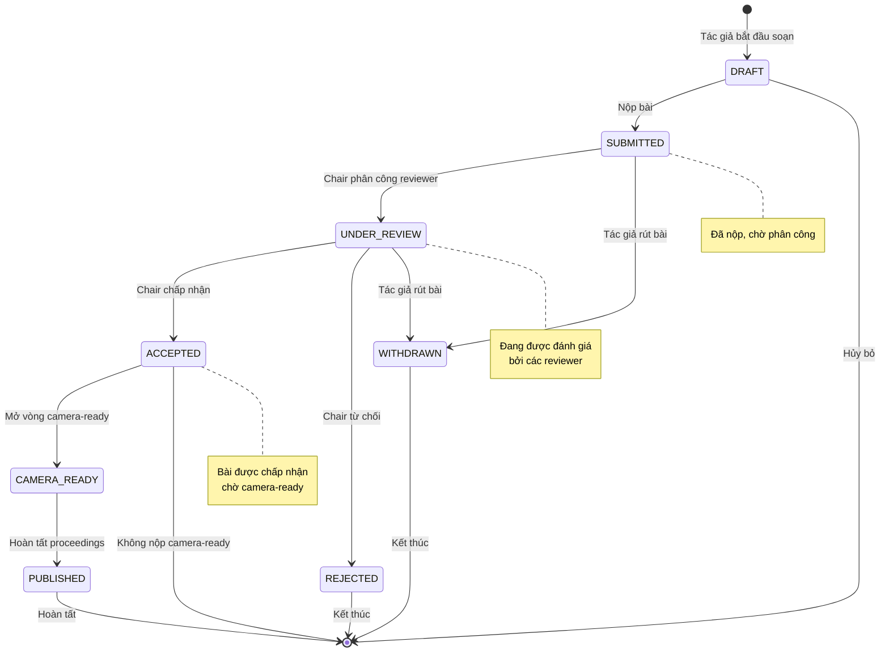
```mermaid
stateDiagram-v2
    [*] --> DRAFT: Tác giả bắt đầu soạn

    DRAFT --> SUBMITTED: Nộp bài
    DRAFT --> [*]: Hủy bỏ

    SUBMITTED --> UNDER_REVIEW: Chair phân công reviewer
    SUBMITTED --> WITHDRAWN: Tác giả rút bài

    UNDER_REVIEW --> ACCEPTED: Chair chấp nhận
    UNDER_REVIEW --> REJECTED: Chair từ chối
    UNDER_REVIEW --> WITHDRAWN: Tác giả rút bài

    ACCEPTED --> CAMERA_READY: Mở vòng camera-ready
    ACCEPTED --> [*]: Không nộp camera-ready

    CAMERA_READY --> PUBLISHED: Hoàn tất proceedings

    REJECTED --> [*]: Kết thúc

    WITHDRAWN --> [*]: Kết thúc

    PUBLISHED --> [*]: Hoàn tất

    note right of SUBMITTED
        Đã nộp, chờ phân công
    end note

    note right of UNDER_REVIEW
        Đang được đánh giá
        bởi các reviewer
    end note

    note right of ACCEPTED
        Bài được chấp nhận
        chờ camera-ready
    end note
```

### 7.2 State Diagram - Trạng Thái Phân Công Review (Assignment Status)

```mermaid
stateDiagram-v2
    [*] --> PENDING: Chair tạo phân công

    PENDING --> ACCEPTED: Reviewer chấp nhận
    PENDING --> DECLINED: Reviewer từ chối
    PENDING --> EXPIRED: Hết thời hạn

    ACCEPTED --> IN_PROGRESS: Bắt đầu đánh giá
    ACCEPTED --> DECLINED: Reviewer thay đổi

    IN_PROGRESS --> COMPLETED: Nộp đánh giá
    IN_PROGRESS --> EXPIRED: Hết deadline

    DECLINED --> [*]: Chờ Chair phân công lại

    EXPIRED --> [*]: Chờ xử lý

    COMPLETED --> [*]: Hoàn tất

    note right of PENDING
        Chờ reviewer xác nhận
    end note

    note right of IN_PROGRESS
        Reviewer đang đánh giá
    end note

    note right of COMPLETED
        Đã nộp đánh giá
    end note
```

### 7.3 State Diagram - Trạng Thái Hội Nghị (Conference Status)

```mermaid
stateDiagram-v2
    [*] --> DRAFT: Chair tạo hội nghị

    DRAFT --> CFP_OPEN: Công bố CFP
    DRAFT --> [*]: Hủy bỏ

    CFP_OPEN --> SUBMISSION_CLOSED: Hết deadline nộp bài
    CFP_OPEN --> DRAFT: Tạm đóng để chỉnh sửa

    SUBMISSION_CLOSED --> REVIEW_PHASE: Mở vòng review

    REVIEW_PHASE --> DECISION_PHASE: Hết deadline review

    DECISION_PHASE --> CAMERA_READY_OPEN: Mở vòng camera-ready

    CAMERA_READY_OPEN --> PROCEEDINGS_READY: Thu thập xong

    PROCEEDINGS_READY --> PUBLISHED: Xuất bản proceedings

    PUBLISHED --> ARCHIVED: Lưu trữ

    ARCHIVED --> [*]: Kết thúc

    note right of CFP_OPEN
        Đang nhận bài nộp
    end note

    note right of REVIEW_PHASE
        Đang đánh giá
    end note

    note right of PUBLISHED
        Đã xuất bản
    end note
```

---

## 8. Sơ Đồ ERD (Entity-Relationship Diagram)

### 8.1 ERD - Thiết Kế Database Chính

```mermaid
erDiagram
    USERS {
        bigint id PK
        varchar email "UK"
        varchar password_hash
        varchar provider
        varchar firebase_uid
        varchar full_name
        varchar affiliation
        varchar avatar_url
        varchar phone
        varchar country
        varchar gender
        varchar address
        date date_of_birth
        text bio
        boolean enabled
        timestamp created_at
        timestamp updated_at
    }

    ROLES {
        bigint id PK
        varchar name "UK"
    }

    USER_ROLES {
        bigint user_id FK
        bigint role_id FK
    }

    CONFERENCES {
        bigint id PK
        varchar name
        text description
        timestamp start_date
        timestamp end_date
        bigint organizer_id FK
        timestamp submission_deadline
        timestamp review_deadline
        timestamp camera_ready_deadline
        boolean is_blind_review
        boolean is_hidden
        boolean is_locked
        timestamp created_at
        timestamp updated_at
    }

    TRACKS {
        bigint id PK
        bigint conference_id FK
        varchar name
        text description
        varchar session_date
        varchar session_time
        varchar room
        timestamp created_at
        timestamp updated_at
    }

    PAPERS {
        bigint id PK
        varchar title
        text abstract_text
        varchar file_path
        varchar camera_ready_path
        varchar status
        bigint main_author_id FK
        bigint track_id FK
        timestamp created_at
        timestamp updated_at
    }

    PAPER_CO_AUTHORS {
        bigint id PK
        bigint paper_id FK
        varchar name
        varchar email
        varchar affiliation
        boolean is_corresponding
    }

    REVIEW_ASSIGNMENTS {
        bigint id PK
        bigint paper_id FK
        bigint reviewer_id FK
        varchar status
        timestamp assigned_date
        timestamp due_date
        timestamp created_at
        timestamp updated_at
    }

    REVIEWS {
        bigint id PK
        bigint assignment_id FK "UK"
        integer score
        integer confidence_level
        text comment_for_author
        text comment_for_pc
        timestamp submitted_at
        timestamp created_at
        timestamp updated_at
    }

    DISCUSSIONS {
        bigint id PK
        bigint paper_id FK
        bigint author_id FK
        text content
        bigint parent_id FK
        boolean is_visible
        timestamp created_at
        timestamp updated_at
    }

    CONFLICTS_OF_INTEREST {
        bigint id PK
        bigint paper_id FK
        bigint reviewer_id FK
        text reason
        timestamp created_at
    }

    %% Relationships
    USERS ||--o{ USER_ROLES : "has"
    ROLES ||--o{ USER_ROLES : "assigned to"
    USERS ||--o{ CONFERENCES : "organizes"
    CONFERENCES ||--o{ TRACKS : "contains"
    TRACKS ||--o{ PAPERS : "contains"
    USERS ||--o{ PAPERS : "submits"
    PAPERS ||--o{ PAPER_CO_AUTHORS : "has"
    PAPERS ||--o{ REVIEW_ASSIGNMENTS : "assigned to"
    USERS ||--o{ REVIEW_ASSIGNMENTS : "reviews"
    REVIEW_ASSIGNMENTS ||--o| REVIEWS : "results in"
    PAPERS ||--o{ DISCUSSIONS : "has"
    USERS ||--o{ DISCUSSIONS : "posts"
    DISCUSSIONS ||--o{ DISCUSSIONS : "replies to"
    PAPERS ||--o{ CONFLICTS_OF_INTEREST : "has"
    USERS ||--o{ CONFLICTS_OF_INTEREST : "declares"
```

### 8.2 ERD - Hệ Thống AI & Audit

```mermaid
erDiagram
    AI_FEATURE_FLAGS {
        bigint id PK
        bigint conference_id FK
        varchar feature_name
        boolean enabled
        timestamp created_at
        timestamp updated_at
    }

    AI_AUDIT_LOGS {
        bigint id PK
        timestamp timestamp
        bigint conference_id FK
        bigint user_id FK
        varchar feature
        varchar action
        text prompt
        varchar model_id
        varchar input_hash
        text output_summary
        boolean accepted
        jsonb metadata
        timestamp created_at
    }

    AUDIT_LOGS {
        bigint id PK
        varchar action
        varchar entity_type
        bigint entity_id
        bigint user_id FK
        text details
        timestamp created_at
    }

    PAPER_SYNOPSES {
        bigint id PK
        bigint paper_id FK
        text synopsis
        text keywords
        text key_points
        varchar model_id
        timestamp generated_at
    }

    EMAIL_DRAFTS {
        bigint id PK
        bigint conference_id FK
        varchar template_type
        varchar subject
        text body
        varchar recipient_type
        boolean is_draft
        timestamp created_at
    }

    USER_ACTIVITY_HISTORY {
        bigint id PK
        bigint user_id FK
        varchar activity_type
        text description
        varchar ip_address
        varchar user_agent
        timestamp created_at
    }

    PASSWORD_RESET_OTPS {
        bigint id PK
        varchar email
        varchar otp
        timestamp expires_at
        boolean used
        timestamp created_at
    }

    PASSWORD_RESET_TOKENS {
        bigint id PK
        bigint user_id FK
        varchar token "UK"
        timestamp expires_at
        boolean used
        timestamp created_at
    }

    %% Relationships
    CONFERENCES ||--o{ AI_FEATURE_FLAGS : "has"
    CONFERENCES ||--o{ AI_AUDIT_LOGS : "logs"
    USERS ||--o{ AI_AUDIT_LOGS : "triggers"
    USERS ||--o{ AUDIT_LOGS : "performs"
    PAPERS ||--o| PAPER_SYNOPSES : "has"
    CONFERENCES ||--o{ EMAIL_DRAFTS : "has"
    USERS ||--o{ USER_ACTIVITY_HISTORY : "has"
    USERS ||--o{ PASSWORD_RESET_TOKENS : "requests"
```

---

## 9. Sơ Đồ BPMN (Business Process Model)

### 9.1 BPMN - Quy Trình Tổng Thể Hội Nghị Khoa Học

```mermaid
flowchart TB
    subgraph Swimlane_Chair["🎯 Chủ Tịch Hội Nghị (Chair)"]
        Start([🚀 Bắt đầu]) --> C1[Tạo hội nghị mới]
        C1 --> C2[Cấu hình Tracks & Deadlines]
        C2 --> C3[Công bố CFP]
        C3 --> C4{Đã hết deadline<br/>nộp bài?}
        C4 -->|Chưa| C3
        C4 -->|Rồi| C5[Đóng nhận bài]
        C5 --> C6[Mời PC Members]
        C6 --> C7[Phân công Reviewer]
        C7 --> C8{Đã hết deadline<br/>review?}
        C8 -->|Chưa| C8
        C8 -->|Rồi| C9[Tổng hợp đánh giá]
        C9 --> C10[Ra quyết định Accept/Reject]
        C10 --> C11[Gửi thông báo]
        C11 --> C12{Mở Camera-ready?}
        C12 -->|Có| C13[Mở vòng Camera-ready]
        C13 --> C14{Đã hết deadline<br/>camera-ready?}
        C14 -->|Chưa| C14
        C14 -->|Rồi| C15[Thu thập bản final]
        C15 --> C16[Xuất Proceedings]
        C12 -->|Không| C16
        C16 --> C17[Công bố Program]
        C17 --> EndC([🏁 Kết thúc])
    end

    subgraph Swimlane_Reviewer["📝 Reviewer"]
        R1[Nhận thông báo phân công] --> R2{Chấp nhận<br/>đánh giá?}
        R2 -->|Không| R3[Từ chối/Khai báo COI]
        R3 --> R4[Thông báo Chair]
        R2 -->|Có| R5[Download bài báo]
        R5 --> R6[Đọc và đánh giá]
        R6 --> R7[Chấm điểm & viết nhận xét]
        R7 --> R8[Nộp đánh giá]
        R8 --> R9{Tham gia<br/>thảo luận?}
        R9 -->|Có| R10[Thảo luận với PC]
        R9 -->|Không| EndR([✓ Hoàn tất])
        R10 --> EndR
    end

    subgraph Swimlane_Author["🧑‍💻 Tác Giả (Author)"]
        A1[Đăng ký tài khoản] --> A2[Xem danh sách CFP]
        A2 --> A3[Chọn hội nghị & Track]
        A3 --> A4[Soạn bài báo]
        A4 --> A5[Thêm đồng tác giả]
        A5 --> A6[Upload file PDF]
        A6 --> A7[Nộp bài]
        A7 --> A8[Chờ kết quả]
        A8 --> A9{Kết quả?}
        A9 -->|Accepted| A10[Nhận thông báo Accept]
        A10 --> A11[Nộp Camera-ready]
        A11 --> EndA([✓ Hoàn tất])
        A9 -->|Rejected| A12[Nhận thông báo Reject]
        A12 --> EndA
    end

    %% Cross-lane connections
    C7 -.->|Gửi thông báo| R1
    R8 -.->|Nộp đánh giá| C9
    A7 -.->|Bài nộp| C4
    C11 -.->|Thông báo kết quả| A8
    A11 -.->|Camera-ready| C14
```

### 9.2 BPMN - Chi Tiết Quy Trình Nộp Bài (Submission Process)

```mermaid
flowchart LR
    subgraph Author["🧑‍💻 Tác Giả"]
        A_Start([Bắt đầu]) --> A1[Truy cập hệ thống]
        A1 --> A2{Đã có<br/>tài khoản?}
        A2 -->|Chưa| A3[Đăng ký]
        A3 --> A4[Xác thực email]
        A4 --> A5[Đăng nhập]
        A2 -->|Có| A5
        A5 --> A6[Xem CFP]
        A6 --> A7[Chọn Track]
        A7 --> A8[Điền form bài báo]
        A8 --> A9{Dùng AI<br/>kiểm tra?}
        A9 -->|Có| A10[Kiểm tra chính tả AI]
        A10 --> A11{Chấp nhận<br/>gợi ý?}
        A11 -->|Có| A12[Áp dụng sửa lỗi]
        A11 -->|Không| A13
        A12 --> A13
        A9 -->|Không| A13[Thêm đồng tác giả]
        A13 --> A14[Upload PDF]
        A14 --> A15[Preview & Submit]
        A15 --> A_End([Hoàn tất])
    end

    subgraph System["⚙️ Hệ Thống"]
        S1{Validate<br/>dữ liệu} --> S2{Còn<br/>deadline?}
        S2 -->|Không| S3[Trả về lỗi]
        S2 -->|Có| S4[Lưu file PDF]
        S4 --> S5[Tạo Paper record]
        S5 --> S6[Lưu CoAuthors]
        S6 --> S7[Ghi Audit Log]
        S7 --> S8[Gửi email xác nhận]
        S8 --> S_End([Thành công])
    end

    A15 -.->|Submit| S1
    S3 -.->|Error| A8
    S_End -.->|Confirmation| A_End
```

### 9.3 BPMN - Chi Tiết Quy Trình Đánh Giá (Review Process)

```mermaid
flowchart TB
    subgraph Chair["🎯 Chair"]
        C_Start([Bắt đầu]) --> C1[Xem danh sách papers]
        C1 --> C2{Sử dụng AI<br/>gợi ý?}
        C2 -->|Có| C3[AI Similarity Analysis]
        C3 --> C4[Xem gợi ý reviewer]
        C4 --> C5[Chọn reviewer]
        C2 -->|Không| C5
        C5 --> C6{Kiểm tra COI}
        C6 -->|Có COI| C7[Chọn reviewer khác]
        C7 --> C5
        C6 -->|Không COI| C8[Xác nhận phân công]
        C8 --> C9[Gửi thông báo]
        C9 --> C10[Theo dõi tiến độ]
        C10 --> C11{Đủ reviews?}
        C11 -->|Chưa| C10
        C11 -->|Rồi| C_End([Chuyển Decision])
    end

    subgraph Reviewer["📝 Reviewer"]
        R_Start([Nhận thông báo]) --> R1{Chấp nhận?}
        R1 -->|Không| R2[Khai báo lý do]
        R2 --> R3[Thông báo Chair]
        R3 --> R_Decline([Từ chối])
        R1 -->|Có| R4[Download paper]
        R4 --> R5{Xem AI<br/>Synopsis?}
        R5 -->|Có| R6[Tạo AI Synopsis]
        R6 --> R7[Đọc synopsis]
        R7 --> R8[Đọc full paper]
        R5 -->|Không| R8
        R8 --> R9[Đánh giá chi tiết]
        R9 --> R10[Chấm điểm]
        R10 --> R11[Viết nhận xét Author]
        R11 --> R12[Viết nhận xét PC]
        R12 --> R13[Submit review]
        R13 --> R14{Thảo luận PC?}
        R14 -->|Có| R15[Tham gia discussion]
        R15 --> R_End([Hoàn tất])
        R14 -->|Không| R_End
    end

    C9 -.->|Notification| R_Start
    R13 -.->|Review submitted| C10
    R3 -.->|Decline notification| C7
```

### 9.4 BPMN - Chi Tiết Quy Trình Ra Quyết Định (Decision Process)

```mermaid
flowchart TB
    subgraph Chair["🎯 Chair"]
        Start([Bắt đầu]) --> D1[Mở trang Decision]
        D1 --> D2[Xem tổng hợp điểm]
        D2 --> D3{Có rebuttal<br/>round?}
        D3 -->|Có| D4[Mở rebuttal]
        D4 --> D5[Chờ author response]
        D5 --> D6[Reviewer xem xét]
        D6 --> D7[Cập nhật đánh giá]
        D7 --> D8
        D3 -->|Không| D8[Xem reviews chi tiết]

        D8 --> D9{Đủ thông tin<br/>quyết định?}
        D9 -->|Chưa| D10[Yêu cầu thêm review]
        D10 --> D8
        D9 -->|Rồi| D11[Ra quyết định]

        D11 --> D12{Decision?}
        D12 -->|Accept| D13[Mark ACCEPTED]
        D12 -->|Reject| D14[Mark REJECTED]

        D13 --> D15[Chuẩn bị email Accept]
        D14 --> D16[Chuẩn bị email Reject]

        D15 --> D17{Dùng AI<br/>draft email?}
        D16 --> D17
        D17 -->|Có| D18[AI Draft Email]
        D18 --> D19[Review & Edit]
        D19 --> D20
        D17 -->|Không| D20[Viết email thủ công]

        D20 --> D21[Gửi thông báo]
        D21 --> D22{Còn paper<br/>chưa quyết định?}
        D22 -->|Có| D8
        D22 -->|Không| End([Hoàn tất])
    end

    subgraph Author["🧑‍💻 Tác Giả"]
        A1[Nhận thông báo] --> A2{Kết quả?}
        A2 -->|Accept| A3[Xem nhận xét]
        A3 --> A4[Chuẩn bị Camera-ready]
        A2 -->|Reject| A5[Xem feedback]
        A5 --> A6([Kết thúc])
        A4 --> A7([Chờ Camera-ready phase])
    end

    D21 -.->|Email notification| A1
```

---

## Tài Liệu Liên Quan

- [Hướng dẫn cài đặt](installation-guide.md)
- [API Specification](api-spec.md)
- [Kiến trúc hệ thống](architecture.md)
- [Hướng dẫn sử dụng](user-guide.md)
- [Bảo mật](security-configuration.md)

---

_Tài liệu được tạo tự động cho dự án UTH-ConfMS_
_Cập nhật: Tháng 01/2026_
